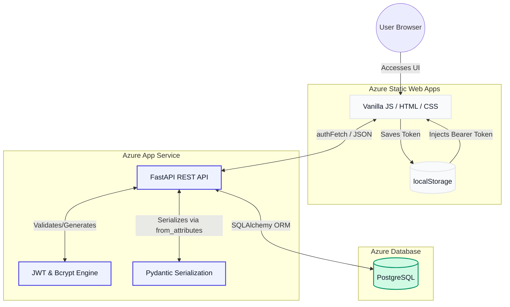

# ADR-001: Decoupled Vanilla JS Frontend with JWT LocalStorage for Azure Deployment

## 1. Context & Problem Statement
The EventHub platform requires a highly responsive, role-based user interface (Student, Admin, Coordinator) that communicates securely with a FastAPI backend. Because this project falls under the **Cloud & DevOps segment (J2)**, the architecture must mirror enterprise-grade cloud topologies, where the frontend and backend scale independently. We needed to decide on the frontend technology stack, the communication protocol, and the state management strategy for user sessions without violating stateless backend principles or creating unnecessary build overhead for a Minimum Viable Product (MVP).

## 2. Decision
We are implementing a **strictly decoupled architecture** using **Vanilla HTML/CSS/JS** for the frontend, communicating with the FastAPI backend via REST endpoints. Authentication is managed using **JSON Web Tokens (JWT)** generated by the backend and stored temporarily in the browser's `localStorage`.

### Implementation Details:
*   **Routing:** Client-side state is protected using `window.location.replace()` to manipulate the browser's history stack, preventing authenticated users from retreating to login states via the back button.
*   **Interceptor Pattern:** A custom JavaScript wrapper function (`authFetch`) globally intercepts outgoing requests to inject the JWT into the `Authorization: Bearer <token>` HTTP header.
*   **Data Serialization:** FastAPI leverages Pydantic with `ConfigDict(from_attributes=True)` to instantly serialize complex SQLAlchemy PostgreSQL ORM objects into JSON for the frontend.

## 3. Consequences

### Positive (The "Why")

* **Cloud-Native Optimization:** Zero build-step for the frontend makes it incredibly lightweight, enabling blazing-fast edge delivery via Azure Static Web Apps.
* **Separation of Concerns:** The Python API can be scaled, tested, or modified entirely independently of the UI presentation layer.
* **CORS Mastery:** Enforces a strong understanding of Cross-Origin Resource Sharing security policies at the FastAPI middleware level.

### Negative (The Trade-offs)

* **Security Vulnerability:** Storing JWTs in `localStorage` exposes them to Cross-Site Scripting (XSS) attacks. If malicious scripts run on the page, they can easily read the token.
* **Manual Routing:** Lacking a framework like React Router, history stack management and route protection require manual JavaScript implementations.
* **Token Invalidation:** Because the backend is strictly stateless, immediately invalidating a session before token expiration requires a separate token blocklist mechanism, which adds overhead.

## 4. Alternatives Considered

| Alternative Stack | Evaluation | Decision | Rationale |
| --- | --- | --- | --- |
| **Server-Side Rendering (Jinja2 + FastAPI)** | High coupling, monolithic structure. | **Rejected** | Violates the Cloud & DevOps separation-of-concerns principles required for the Azure deployment strategy. Fails to simulate enterprise microservice architectures. |
| **React / Next.js Frameworks** | Powerful routing, complex state management. | **Rejected** | Introduces unnecessary build complexity, massive dependency footprints (`node_modules`), and overhead for an MVP internal tool primarily relying on basic CRUD operations. |
| **HttpOnly Cookies for JWT** | High security, protects against XSS attacks. | **Deferred** | While significantly more secure than `localStorage`, setting cross-origin `HttpOnly` cookies in a decoupled local testing environment introduces immense CORS and configuration friction. *Planned for implementation in Week 4/Final deployment.* |

## 5. Security & Threat Modeling Mitigation

To counter the inherent risks of our chosen architecture, the following guardrails are implemented:

| Threat | Description | Implemented Mitigation |
| --- | --- | --- |
| **Cross-Site Scripting (XSS)** | Attacker injects malicious scripts to steal `localStorage` tokens. | Enforcing strict input sanitization on the FastAPI backend using Pydantic strings to ensure no executable code is saved or served back to the UI. |
| **Cross-Site Request Forgery (CSRF)** | Attacker forces user's browser to execute unwanted actions. | JWTs sent via Authorization headers are naturally immune to CSRF compared to automatically attached cookies. Explicit CORS policies reject unauthorized origins. |
| **Stale Sessions** | Token remains valid long after a user finishes working. | JWT payload strictly enforces a short time-to-live (`ACCESS_TOKEN_EXPIRE_MINUTES = 60`). Users must re-authenticate frequently. |

---
## 6. Architectural Diagrams

### 3.1. Infrastructure Decoupling
The following diagram illustrates how the frontend and backend are physically separated within the Azure ecosystem, joined only by the JWT-authenticated REST bridge.

