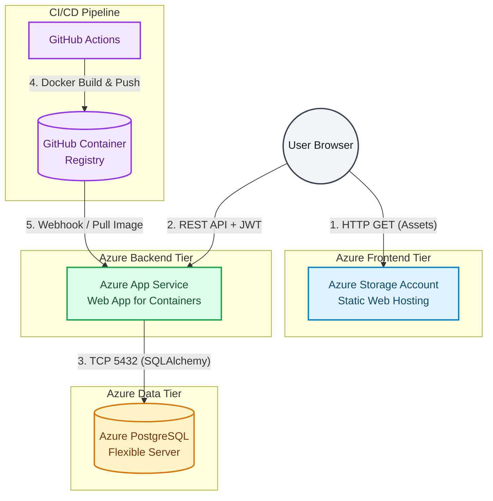

# ADR-002: Unified Azure PaaS Ecosystem for Full-Stack Hosting

## 1. Context & Problem Statement
EventHub is a decoupled, full-stack application comprising a Vanilla JS frontend, a containerized FastAPI backend, and a relational PostgreSQL database. As a project in the **Cloud & DevOps segment (J2)**, the deployment strategy must mirror enterprise-grade cloud topologies. 

We faced a critical infrastructure decision: adopt a **fragmented multi-PaaS approach** (e.g., Vercel for frontend, Render for backend, Supabase for database) or commit to a **unified single-cloud provider ecosystem**. Fragmented stacks offer easy "push-to-deploy" workflows but fail to simulate real-world enterprise tenancy, unified IAM (Identity and Access Management), and centralized observability.

## 2. Decision
We deployed the entire EventHub stack within the **Microsoft Azure PaaS (Platform-as-a-Service) ecosystem**. This ensures all infrastructure components reside within a single Azure Tenant, allowing for unified billing, centralized Azure Monitor logging, and native virtual network (VNet) integration capabilities.

### The Azure Stack Selection:
| Component | Azure Service Chosen | Role in Architecture |
| :--- | :--- | :--- |
| **Frontend Hosting** | **Azure Storage Account** (Static Website) | Serves HTML/CSS/JS directly from the edge. Extremely low latency and zero compute cost for static assets. |
| **Backend Compute** | **Azure App Service** (Web App for Containers) | Hosts the Dockerized FastAPI application. Provides auto-scaling, health checks, and native integration with container registries. |
| **Container Registry** | **GitHub Container Registry (GHCR)** | Stores the built Docker images. Azure App Service pulls the latest image via CI/CD pipelines upon merge to `main`. |
| **Database** | **Azure Database for PostgreSQL** (Flexible Server) | Managed relational database with automated backups, high availability, and strict network isolation via firewall rules. |

## 3. Architectural Topology
The following diagram illustrates the network flow and service decoupling within the Azure ecosystem.

## 4. Service Comparison Matrix
Why Azure over the "easy" startup stacks?

| Feature | Azure PaaS (Our Choice) | Vercel + Render + Supabase | Heroku |
| :--- | :--- | :--- | :--- |
| **Infrastructure Cohesion** | **High:** Single pane of glass (Azure Portal). | **Low:** 3 separate dashboards, 3 billing systems. | **Medium:** Unified but locked into Heroku's ecosystem. |
| **Networking & Security** | **Enterprise:** VNet injection, Private Endpoints, NSGs. | **Basic:** Public internet routing, basic CORS. | **Basic:** Heroku Private Spaces (very expensive). |
| **Container Support** | **Native:** Pulls directly from GHCR/DockerHub. | **Poor:** Vercel is serverless-only; Render requires specific Dockerfiles. | **Good:** Native Docker support but sleeps on free tier. |
| **Database Management** | **Full Control:** Flexible server, read replicas, pgBouncer. | **Abstracted:** Supabase hides underlying Postgres configs. | **Managed:** Good, but expensive to scale. |
| **Enterprise Simulation** | **Excellent:** Mirrors real-world corporate cloud tenancy. | **Poor:** Feels like a "toy" hobbyist stack. | **Medium:** Good for startups, less for enterprise. |

## 5. Consequences
### Positive (The "Why")
* **Enterprise Simulation:** Accurately simulates real-world corporate single-tenant cloud architecture, providing massive value for Cloud/DevOps placement interviews.
* **Unified Observability:** Application Insights and Azure Monitor can trace a request from the App Service directly down to the PostgreSQL query layer.
* **Cost Management:** Centralized billing allows for strict budget alerts and cost-analysis across compute, storage, and database resources.

### Negative (The Trade-offs)
* **Steeper Learning Curve:** The Azure Portal is notoriously dense. Configuring IAM roles, CORS across different Azure domains, and networking rules requires significantly more effort than Vercel's "Zero-Config" deployment.
* **Manual Container Orchestration:** Unlike platforms that auto-detect a `requirements.txt` file, Azure App Service requires explicit Dockerfile management, GHCR authentication, and Webhook configuration.

## 6. Alternatives Considered
1. **Vercel (Frontend) + Render (Backend) + Supabase (DB):** Rejected. While excellent for rapid prototyping, it fragments infrastructure across multiple vendors, making enterprise-scale monitoring and unified security policies impossible to simulate.
2. **AWS Elastic Beanstalk + RDS:** Rejected. While functionally identical to Azure, the choice of Azure aligns better with the Azure Communication Services integration (ADR-003) and specific university partnership ecosystems.
3. **Self-Hosted on Azure VM (IaaS):** Rejected. Managing Linux updates, Docker daemon restarts, and Nginx reverse proxies manually violates the PaaS philosophy and distracts from application-level development.

