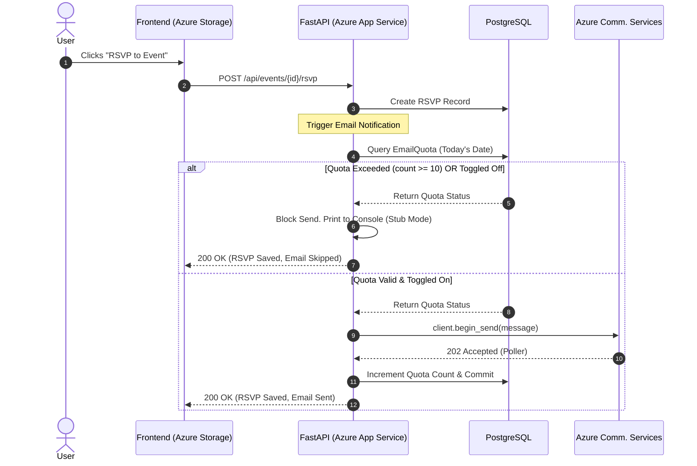

# ADR-003: Azure Communication Services (ACS) & Guardrails for Transactional Emails

## 1. Context & Problem Statement
The Week 3 Mini-Extension requires an automated notification system: sending OTPs for secure registration, RSVP confirmations, and cron-triggered 24-hour event reminders. 

Standard transactional email providers (SendGrid, Resend, Mailgun) enforce strict "sandbox" modes for free tiers. To send emails to arbitrary users, developers must configure complex DNS records (SPF, DKIM, DMARC) and undergo manual domain verification. For a student demo environment where a custom public domain may not be readily available or configurable, this creates massive friction and blocks the demonstration of the actual business logic.

## 2. Decision
We selected **Azure Communication Services (ACS)** for the email delivery pipeline. Furthermore, to prevent API abuse and manage cloud costs during live demonstrations, we engineered a **custom application-level guardrail system** consisting of an `EmailQuota` database model and a global frontend toggle switch.

### Implementation Details:
1. **Native SDK Integration:** Utilized the `azure-communication-email` Python SDK, authenticating via a unified Azure Connection String rather than complex SMTP relay configurations.
2. **The `EmailQuota` Guardrail:** Created a database table that tracks daily email sends. The `send_email_stub` function intercepts all outbound requests. If `count >= 10` or `is_valid == False`, the email is blocked, and the payload is printed to the server console as a "stub" instead.
3. **Global Toggle Endpoint:** Exposed a `PUT /api/system/toggle-email` endpoint, allowing Coordinators to instantly disable the live email pipeline from the frontend UI without redeploying the code.

## 3. Email Delivery & Guardrail Flow
This sequence diagram illustrates how the backend intercepts email requests to enforce quotas before hitting the external Azure API.

## 4. Provider Comparison Matrix

| Feature | Azure Comm. Services (Our Choice) | SendGrid / Resend | Local SMTP (Mailhog) |
| :--- | :--- | :--- | :--- |
| **Sandbox Friction** | **Low:** Managed sandbox allows sending to verified addresses via Connection String. | **High:** Requires strict DNS (SPF/DKIM) and domain verification to exit sandbox. | **None:** Local only, but useless for live cloud demos. |
| **Ecosystem Integration** | **Native:** Shares Azure Tenant, billing, and IAM. | **Fragmented:** Requires external API keys and separate dashboards. | **N/A** |
| **Cost Guardrails** | **Custom Built:** Implemented via `EmailQuota` DB model. | **Native:** Platform handles rate limiting, but hard to toggle dynamically. | **Free** |
| **SDK Maturity** | **Good:** Official Python SDK, slightly less community presence. | **Excellent:** Massive community support and StackOverflow presence. | **N/A** |

## 5. Consequences
### Positive (The "Why")
* **Bypasses DNS Friction:** Allowed immediate implementation and testing of the OTP and RSVP workflows without waiting on domain registry propagation or DNS record verification.
* **Abuse Prevention:** The `EmailQuota` model proves an understanding of cloud cost-management. In a real production environment, an infinite loop or malicious script could rack up thousands of dollars in API fees; our guardrail hard-limits this risk.
* **Unified Cloud Bill:** Keeps the entire infrastructure footprint inside the Azure portal, simplifying the DevOps narrative.

### Negative (The Trade-offs)
* **Synchronous Blocking:** The `azure-communication-email` SDK's `begin_send()` poller can block the main FastAPI thread if not carefully managed. In a future iteration, this should be offloaded to FastAPI `BackgroundTasks` or an Azure Service Bus queue.
* **Sender Address Limitations:** ACS still requires the sender email to be provisioned within the Azure Email Communication Service domain, limiting arbitrary "from" addresses compared to fully verified custom domains.

## 6. Alternatives Considered
1. **SendGrid / Resend:** Rejected due to the high friction of domain verification and DNS configuration required to send emails to arbitrary users in a time-conained demo environment.
2. **Local SMTP Stub (Mailhog / Console Logging):** Rejected because the goal of the mini-extension was to prove competence in integrating *real* external cloud APIs and handling network timeouts, not just local dev tools.
3. **AWS SES (Simple Email Service):** Rejected to maintain ecosystem cohesion with the rest of the Azure PaaS deployment (ADR-002). Cross-cloud networking introduces unnecessary IAM complexity for an MVP.
