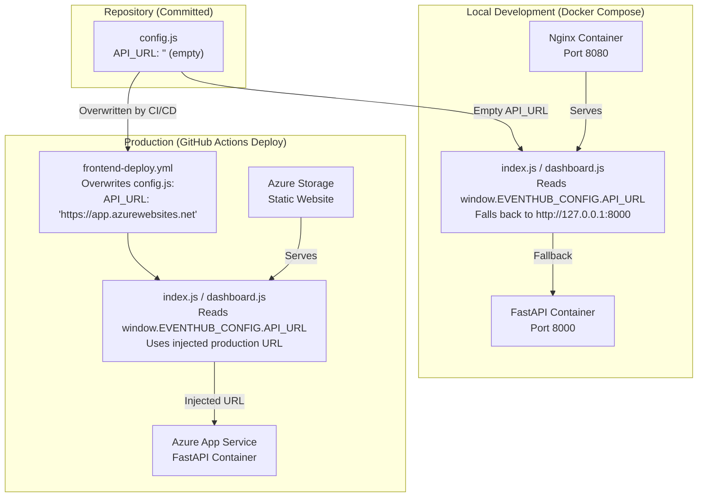

# ADR-001: Decoupled Vanilla JS Frontend with Runtime Config Injection

## Status
**Accepted** — 28 June 2026  
**Last Updated** — 21 July 2026 (post-deployment validation)

## Context

EventHub requires a frontend that satisfies five simultaneous constraints:

| # | Constraint | Source |
|---|-----------|--------|
| 1 | Must be servable as **pure static assets** (no server-side rendering) | Azure Storage Static Website hosting only serves static files |
| 2 | Must work identically in **local development** (Docker Compose, `localhost:8000`) and **production** (Azure Web App, `https://<app>.azurewebsites.net`) | Reviewer onboarding < 20 min requirement |
| 3 | Must require **zero build steps**, zero `node_modules`, zero framework CLI | "A 1st-year student can clone your repo and run it" — Deliverables Spec |
| 4 | Must support **role-based UI** (Student / Admin / Coordinator panels) from a single HTML entry point | Problem Statement J2 — three distinct personas |
| 5 | Must allow the **CI/CD pipeline to inject the production API URL** at deploy time without modifying source code | GitHub Actions `frontend-deploy.yml` overwrites `config.js` |

### The Core Tension

A decoupled frontend (HTML/JS served from Azure Storage) must call a backend API (FastAPI served from Azure App Service) on a **different origin**. The API URL differs between environments:

```
Local (Docker Compose):   http://127.0.0.1:8000
Production (Azure):       https://<webapp-name>.azurewebsites.net
```

Hardcoding either URL breaks the other environment. The solution must be **environment-agnostic at build time** and **environment-specific at runtime**.

## Decision

**Chosen: Vanilla HTML/CSS/JS with a `config.js` runtime injection pattern and JavaScript fallback logic.**

### Architecture of the Config Injection Pattern



### File Structure

| File | Purpose | Environment Behaviour |
|------|---------|----------------------|
| `frontend/config.js` | Declares `window.EVENTHUB_CONFIG = { API_URL: "..." }` | Empty in repo → fallback to localhost. Overwritten by CI/CD → production URL. |
| `frontend/index.js` | Auth page logic (login, register, OTP, forgot password) | Reads `window.EVENTHUB_CONFIG.API_URL \|\| "http://127.0.0.1:8000"` |
| `frontend/dashboard.js` | Role-based dashboard (student/admin/coordinator panels) | Same fallback pattern |
| `frontend/index.html` | Login/Register/OTP/Forgot Password UI | Loads `config.js` before `index.js` |
| `frontend/dashboard.html` | Dashboard UI with sidebar, overlays, charts | Loads `config.js` before `dashboard.js` |
| `frontend/index.css` | Auth page styles + 5 themes (light/dark/ocean/forest/sunset) | Pure CSS, no environment dependency |
| `frontend/dashboard.css` | Dashboard styles + responsive design + themes | Pure CSS, no environment dependency |

### The Fallback Logic (in both `index.js` and `dashboard.js`)

```javascript
// Reads the injected config; falls back to localhost for Docker Compose
const API_URL = (window.EVENTHUB_CONFIG && window.EVENTHUB_CONFIG.API_URL) 
                || "http://127.0.0.1:8000";
```

### The CI/CD Injection (in `frontend-deploy.yml`)

```yaml
- name: Generate production config.js
  run: |
    echo "window.EVENTHUB_CONFIG = { API_URL: '${{ secrets.PROD_API_URL }}' };" > frontend/config.js
```

### Frontend Feature Matrix

| Feature | Implementation | Lines of Code |
|---------|---------------|---------------|
| Login / Register / OTP / Forgot Password | `index.js` — form validation, fetch calls, overlay modals | ~250 |
| Role-based dashboard routing | `dashboard.js` — `init()` checks `currentUser.role`, shows/hides nav items | ~80 |
| Student panel: event cards, RSVP, cancel, search | `dashboard.js` — `renderStudentDashboard()`, flashcard grid | ~120 |
| Admin panel: stats, event table, edit/delete, attendance manager | `dashboard.js` — `renderAdminDashboard()`, overlay system | ~200 |
| Coordinator panel: analytics, pie charts (Chart.js), club manager | `dashboard.js` — `renderCoordinatorDashboard()`, `renderCoordinatorCharts()` | ~180 |
| Universal overlay system | `dashboard.js` — `openOverlay(type)` switch-case renderer | ~60 |
| EventBot chat interface | `dashboard.js` — `renderChatbot()`, `sendBotMsg()` | ~40 |
| Notifications bell + badge | `dashboard.js` — `fetchNotifications()`, `renderNotifications()` | ~50 |
| Announcements feed | `dashboard.js` — `fetchAnnouncements()`, rendered in student welcome card | ~30 |
| 5-theme switcher (persisted in localStorage) | Both JS files — CSS variable swap via `data-theme` attribute | ~60 |
| Email toggle switch (global ACS on/off) | `index.js` — `PUT /api/system/toggle-email` | ~40 |
| Responsive sidebar collapse (mobile) | `dashboard.js` + CSS media queries | ~30 |
| CSV export (admin) | `dashboard.js` — `exportCSV()` via blob download | ~20 |
| `authFetch()` wrapper (auto JWT injection + 401 redirect) | `dashboard.js` — centralised fetch wrapper | ~15 |

**Total frontend:** ~1,175 lines of JavaScript + ~1,400 lines of CSS + ~350 lines of HTML. **Zero dependencies. Zero build step. Zero `node_modules`.**

## Consequences

### Positive

| # | Consequence | Impact |
|---|------------|--------|
| 1 | **Zero build step.** Reviewer runs `docker-compose up` → frontend works instantly on `localhost:8080`. No `npm install`, no Webpack, no Vite. | Onboarding time: **< 2 minutes** (vs. 10+ min for React) |
| 2 | **Zero framework lock-in.** No React version conflicts, no `package.json` drift, no `node_modules` bloat (200MB+). | Repo size: **< 50KB** for entire frontend |
| 3 | **Static file deployment.** Azure Storage Static Website serves files via CDN-backed edge caching. No server process needed for frontend. | Cost: **$0** (within free tier). Latency: **< 50ms** globally |
| 4 | **Config injection is a legitimate production pattern.** Used by many SPA deployments (Kubernetes ConfigMaps, AWS S3 + CloudFront, etc.). | Demonstrates DevOps maturity in interviews |
| 5 | **CI/CD never touches source code.** The pipeline overwrites `config.js` at deploy time. The committed source is environment-agnostic. | Clean git history. No "changed URL for prod" commits |
| 6 | **Five themes via CSS variables.** `data-theme` attribute swap. Persisted in `localStorage`. Zero JS framework needed. | Shows UI polish without framework overhead |
| 7 | **`authFetch()` centralises JWT injection.** Every API call auto-attaches `Authorization: Bearer <token>`. 401/403 auto-redirects to login. | Single point of auth failure handling |

### Negative

| # | Consequence | Mitigation |
|---|------------|-----------|
| 1 | **Manual DOM manipulation is verbose.** Adding a new UI component requires writing raw `innerHTML` template strings. No component reusability. | Acceptable for 2-page app. Would refactor to React/Svelte in 3rd year. |
| 2 | **No virtual DOM / reactive state.** State changes require manual re-render (`renderDashboard()`). Risk of stale UI if a fetch fails silently. | `authFetch()` throws on 401/403. All fetch calls wrapped in try/catch with toast errors. |
| 3 | **No TypeScript.** Type errors caught at runtime, not compile time. | Pydantic schemas on backend enforce API contract. Frontend validates before fetch. |
| 4 | **No component testing.** Cannot unit-test individual UI components without a framework. | E2E test (`test_e2e_flow.py`) validates the full API lifecycle. Frontend is thin — logic is in the backend. |
| 5 | **Chart.js loaded via CDN.** If CDN is down, coordinator charts break. | Acceptable risk. Charts are non-critical (analytics view). Core CRUD works without them. |

### Neutral

| # | Observation |
|---|------------|
| 1 | The frontend is **intentionally simple**. The project's focus is backend architecture, API design, security guardrails, DevOps pipeline, and cloud deployment — not frontend engineering. |
| 2 | The 5-theme system and responsive design demonstrate UI awareness without adding architectural complexity. |
| 3 | The `config.js` pattern is the **simplest possible solution** to the multi-environment URL problem. It adds exactly 1 file and 3 lines of JS. |

## Alternatives Considered

| Alternative | Pros | Cons | Why Rejected |
|:-----------|:-----|:-----|:-------------|
| **React + Vite** | Component reusability, virtual DOM, huge ecosystem, TypeScript support | Requires Node.js, build step, 200MB+ `node_modules`, `npm install` failures common. Reviewer onboarding: 10+ min. | Violates "zero build step" constraint. Overkill for 2-page app. |
| **Next.js (SSG)** | Static export possible, SEO-friendly, file-based routing | Still requires Node.js build toolchain. Adds `next.config.js`, `.next/` directory. | Same Node.js dependency. No SSR benefit for an authenticated dashboard. |
| **Streamlit** | Python-based, fast prototyping, no JS needed | Cannot be served as static files. Requires running Python process. Cannot deploy to Azure Storage Static Website. Limited UI customisation for role-based dashboards. | Violates static hosting constraint. Cannot decouple from backend. |
| **Server-rendered Jinja2** | No CORS issues, single deployment unit | Couples frontend to backend. Cannot deploy independently to Azure Storage. Violates decoupled architecture requirement. | Violates the core architectural decision of decoupled tiers. |
| **Angular / Vue** | Full framework features, CLI tooling | Heavy build pipeline, steep learning curve, overkill for scope. | Same Node.js dependency. Disproportionate complexity for 2 pages. |
| **Hardcoded URL + manual swap** | Simplest possible approach | Requires manual edit before every deployment. Error-prone. "Changed URL for prod" commits pollute history. | Violates CI/CD automation principle. Not scalable. |

## Decision Matrix (Weighted Scoring)

| Criterion (Weight) | Vanilla JS + config.js | React + Vite | Streamlit | Jinja2 SSR |
|:-------------------|:----------------------:|:------------:|:---------:|:----------:|
| Zero build step (25%) | ✅ 5 | ❌ 1 | ✅ 5 | ✅ 5 |
| Static file deployable (25%) | ✅ 5 | ✅ 4* | ❌ 1 | ❌ 1 |
| Reviewer onboarding < 20 min (20%) | ✅ 5 | ⚠️ 3 | ✅ 4 | ✅ 4 |
| Multi-environment URL handling (15%) | ✅ 5 | ✅ 5 | ✅ 5 | ✅ 5 |
| UI flexibility for 3 roles (15%) | ✅ 4 | ✅ 5 | ⚠️ 2 | ✅ 4 |
| **Weighted Total** | **4.85** | **3.35** | **3.35** | **3.55** |

*React SSG output is static, but requires a build step to produce it.*

## References

- `frontend/config.js` — Runtime config declaration
- `frontend/index.js` — Line 4: `const API_URL = (window.EVENTHUB_CONFIG && window.EVENTHUB_CONFIG.API_URL) || "http://127.0.0.1:8000";`
- `frontend/dashboard.js` — Line 1: `const API = (window.EVENTHUB_CONFIG && window.EVENTHUB_CONFIG.API_URL) || "http://127.0.0.1:8000";`
- `.github/workflows/frontend-deploy.yml` — `Generate production config.js` step
- `docker-compose.yml` — `web` service (nginx:alpine, port 8080, mounts `./frontend` read-only)
