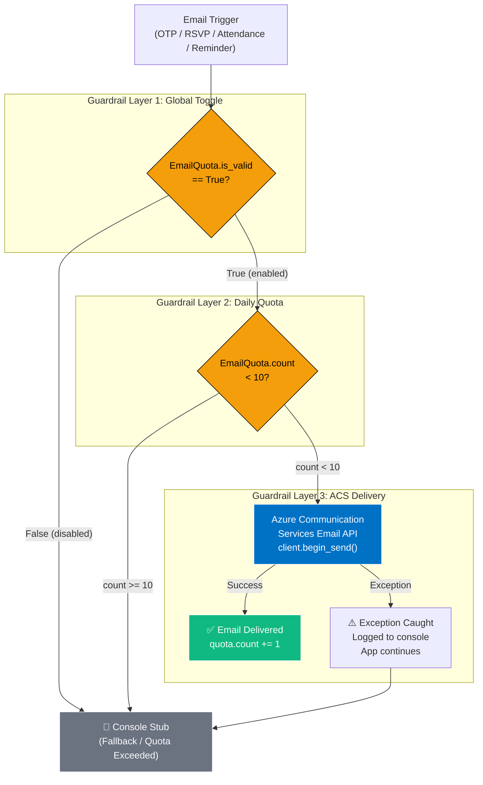
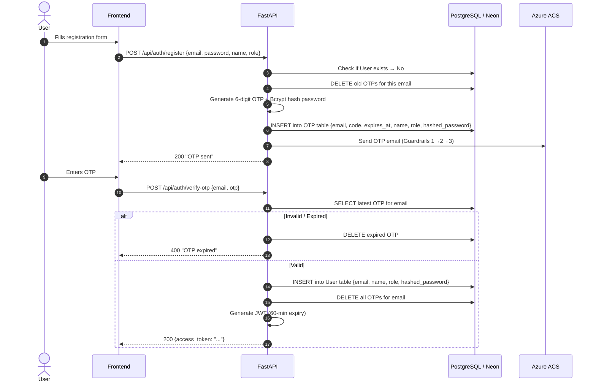

# ADR-003: Azure Communication Services (ACS) for Transactional Emails with Database-Backed Quota Guardrail

## Status
**Accepted** — 12 July 2026  
**Last Updated** — 21 July 2026 (post-deployment validation with live ACS)

## Context

EventHub's **Week 3 Mini-Extension** (per Problem Statement J2, Section 5) requires a **Notification System** that sends real emails for:

| Trigger | Email Content | Frequency |
|:--------|:-------------|:----------|
| User registers | 6-digit OTP code (expires in 15 min) | Per registration |
| User requests password reset | Reset OTP code | Per request |
| Student RSVPs to event | "RSVP Confirmed: {event title}" | Per RSVP |
| Admin submits attendance | Bulk email to all RSVP'd students with Present/Absent status | Per event finalization |
| 24 hours before event | Reminder email to all registered students | Per event (cron-triggerable) |

### The Problem Statement's Suggestion vs. Reality

The problem statement says: *"use SendGrid free tier or a stub."*

However, the project is deployed on **Azure**, and the goal is to demonstrate **cloud-native integration skills** for a Cloud & DevOps segment. A console stub meets the minimum bar but doesn't demonstrate real engineering. SendGrid introduces friction:

| Factor | SendGrid | Azure ACS |
|:-------|:--------:|:---------:|
| Domain verification (DNS TXT) | Required (24–48h wait) | Not needed (`azurecomm.net` sender) |
| Credit card | Required for free tier | Not required (Azure free account) |
| "Sent via SendGrid" footer | Required on free tier | Not required |
| Azure IAM integration | None | Native (connection string + managed identity) |
| SDK | `sendgrid` (third-party) | `azure-communication-email` (first-party) |
| Free tier limit | 100 emails/day | 100 emails/day (Azure free account) |

### The Abuse Prevention Problem

During demos, testing, and Loom recordings, the email pipeline will be triggered repeatedly. Without guardrails:
- A loop bug could send 100+ emails in seconds, exhausting the daily quota.
- Reviewers testing the app could accidentally spam real inboxes.
- The Loom demo needs a way to **show** the email system without actually sending emails to real addresses.

## Decision

**Chosen: Azure Communication Services (ACS) Email with a three-layer guardrail system.**

### Architecture of the Email Pipeline



### The Three Guardrail Layers

| Layer | Mechanism | Purpose |
|:------|:----------|:--------|
| **1. Global Toggle** | `EmailQuota.is_valid` boolean in DB. Controlled via `PUT /api/system/toggle-email?toggle=true\|false` and a frontend toggle switch (top-left of login page). | Instantly disable all emails for demos/testing without redeploying. |
| **2. Daily Quota** | `EmailQuota.count` integer in DB. Hard limit: **10 emails/day**. Reset at midnight (new date string). | Prevents accidental quota exhaustion during demos or loop bugs. |
| **3. Exception Handling** | `try/except` around `client.begin_send()`. On failure, logs to console and continues. App never crashes due to email failure. | Graceful degradation. If ACS is unreachable, the app still works. |

### Implementation (`email_extension.py`)

```python
def send_email_stub(reciever_email: str, subject: str, body: str, db: Session):
    # --- GUARDRAIL 1 & 2: Rate Limiting ---
    today_str = datetime.now().strftime("%Y-%m-%d")
    quota = db.query(models.EmailQuota).filter(models.EmailQuota.date == today_str).first()
    if not quota:
        quota = models.EmailQuota(date=today_str, count=0)
        db.add(quota)
    
    if quota.count >= 10 or quota.is_valid == False:
        # Console fallback
        print(f"📧 EMAIL STUB (QUOTA/DISABLED)\nTo: {reciever_email}\nSubject: {subject}\nBody: {body}")
        return
    
    # --- GUARDRAIL 3: ACS Delivery with Exception Handling ---
    try:
        from azure.communication.email import EmailClient
        client = EmailClient.from_connection_string(connection_string)
        message = {
            "senderAddress": sender_email,
            "recipients": {"to": [{"address": reciever_email}]},
            "content": {"subject": subject, "plainText": body}
        }
        poller = client.begin_send(message)
        result = poller.result()
        quota.count += 1
        db.commit()
    except Exception as ex:
        print(f"Error sending email: {ex}")  # Graceful degradation
    
    # Always log to console (for demo visibility)
    print(f"📧 EMAIL → To: {reciever_email} | Subject: {subject}")
```

### Email Trigger Points in the Codebase

| Endpoint / Function | Email Sent | Guardrails Active |
|:-------------------|:-----------|:-----------------:|
| `POST /api/auth/register` | OTP code (6-digit, 15-min expiry) | ✅ All 3 |
| `POST /api/auth/forgot-password` | Password reset OTP | ✅ All 3 |
| `POST /api/events/{id}/rsvp` | "RSVP Confirmed: {title}" | ✅ All 3 |
| `POST /api/admin/events/{id}/submit-attendance` | Bulk: "Attendance Finalized: {title} — Present/Absent" | ✅ All 3 |
| `POST /api/system/send-reminders` | "Reminder: {title} is tomorrow!" (24h window) | ✅ All 3 |

### The OTP Registration Architecture

Instead of creating unverified `User` records (which bloat the database), the system uses a **pending registration pattern**:



**Key insight:** The `User` table only ever contains **verified** accounts. The `OTP` table is a transient staging area that self-cleans.

### Frontend Toggle Integration

The login page (`index.html`) has a floating toggle switch (top-left corner):

```html
<div class="email-toggle-container">
    <span class="toggle-label">Send Emails</span>
    <label class="switch">
        <input type="checkbox" id="emailToggleBtn">
        <span class="slider round"></span>
    </label>
</div>
```

On page load, `index.js` calls `PUT /api/system/toggle-email?toggle=false` to **default emails OFF** in demo environments. The reviewer can flip it ON to see real emails.

### In-App Notifications (Complementary Channel)

Alongside emails, every significant action creates an in-app `Notification` record:

| Action | Notification Message |
|:-------|:--------------------|
| RSVP confirmed | "RSVP Confirmed: You are registered for {title}!" |
| RSVP cancelled | "RSVP Cancelled: You are no longer registered for {title}." |
| Attendance finalized | "Attendance Finalized: Your attendance for {title} has been marked as {Present/Absent}." |
| Event deleted | "Event Deleted: You deleted the event '{title}'." |
| Event updated | "Event Updated: You updated the event '{title}'." |
| Event missed (cleanup) | "Event Missed: The time for {title} has passed." |

Notifications are accessible via the bell icon in the dashboard header, with an unread count badge.

## Consequences

### Positive

| # | Consequence | Impact |
|---|------------|--------|
| 1 | **Real emails arrive in real inboxes.** Not a console stub. Demonstrable in Loom video and to reviewers. | Exceeds the "or a stub" minimum. Shows cloud-native engineering. |
| 2 | **Native Azure integration.** Connection string integrates with Azure IAM. No third-party DNS verification. No "Sent via SendGrid" footer. | Clean, professional emails. Zero setup friction. |
| 3 | **Three-layer guardrail prevents abuse.** Toggle + quota + exception handling. Cannot accidentally spam. | Safe for demos, testing, and Loom recordings. |
| 4 | **Global toggle for demo safety.** Reviewer can flip emails ON/OFF without redeploying. Defaults to OFF on page load. | Loom demo can show the toggle working without spamming real inboxes. |
| 5 | **OTP prevents database bloat.** Unverified users never enter the `User` table. OTP records self-clean on expiry. | Clean database. No orphaned unverified accounts. |
| 6 | **Graceful degradation.** If ACS is unreachable, the app logs to console and continues. No 500 errors. | App works even if Azure ACS has an outage. |
| 7 | **Dual-channel notifications.** Email (external) + in-app notification (internal). Users get both. | Redundancy. If email fails, in-app notification still informs the user. |
| 8 | **100% free.** ACS provides 100 emails/day free with Azure free account. The 10-email app-level limit is well within this. | Meets the free-tier constraint with margin. |

### Negative

| # | Consequence | Mitigation |
|---|------------|-----------|
| 1 | **Azure lock-in.** The email implementation is specific to ACS. Migrating to AWS/GCP requires rewriting `email_extension.py`. | Acceptable for a single-cloud project. The module is isolated (one file, one function). Swapping to SendGrid/SES is a 30-line change. |
| 2 | **Synchronous sending.** `client.begin_send()` blocks the request handler. Bulk attendance emails (50 students) add 5–10s latency. | Should move to `BackgroundTasks` in production. Documented in "Known Limitations". Acceptable for current scale. |
| 3 | **Plain text only.** ACS doesn't support HTML email templates natively. All emails are plain text. | Acceptable for transactional emails (OTP, confirmations). HTML templates would be a 3rd-year enhancement. |
| 4 | **Connection string in environment.** Sensitive credential stored in `.env` (local) and GitHub Secrets (CI/CD). | Never committed to repo. `.env.example` ships empty. GitHub Secrets are encrypted at rest. Production should use Azure Key Vault + managed identity (3rd year). |
| 5 | **10-email/day limit is conservative.** A real deployment with 200+ clubs would need more. | Intentional for student project scope. Prevents accidental abuse. Easy to increase by changing one integer. |
| 6 | **No email delivery tracking.** ACS `begin_send()` returns a poller, but we don't track delivery status (delivered/bounced/failed). | Acceptable for MVP. Would add a `DeliveryReceipt` table in production. |

### Neutral

| # | Observation |
|---|------------|
| 1 | The 10-email/day limit is a **deliberate engineering decision**, not a technical limitation. It demonstrates rate-limiting thinking — a skill interviewers look for. |
| 2 | The console fallback (when quota exceeded or toggle off) still prints the full email content. This makes the system **demoable without sending real emails**. |
| 3 | The `EmailQuota` table resets daily via the date string key (`YYYY-MM-DD`). No cron job needed for reset. |
| 4 | The OTP table doubles as a password-reset mechanism (with dummy `name="FORGOT"` fields). This avoids creating a separate `PasswordResetOTP` table. |

## Alternatives Considered

| Alternative | Pros | Cons | Why Rejected |
|:-----------|:-----|:-----|:-------------|
| **SendGrid (Free Tier)** | 100 emails/day. Well-documented. Large ecosystem. | Requires domain verification (DNS TXT, 24–48h). "Sent via SendGrid" footer on free tier. Requires credit card. Not Azure-native. | DNS verification friction. Third-party dependency outside Azure ecosystem. Footer looks unprofessional. |
| **Mailgun** | 100 emails/day for 3 months. Good API. | Free tier expires after 3 months. Requires credit card. Not Azure-native. | Expires mid-project. Credit card required. |
| **AWS SES** | 62,000 emails/month free (from EC2). Cheap. | Project is on Azure. Cross-cloud email adds IAM complexity, latency, and cost. | Wrong cloud. Adds unnecessary cross-cloud dependency. |
| **Console stub only** | Zero cost. Zero setup. Meets minimum requirement. | Doesn't demonstrate real cloud integration. Reviewers and interviewers are more impressed by working emails. | Meets minimum bar but doesn't differentiate. The mini-extension is meant to go "beyond the minimum". |
| **Nodemailer / SMTP** | Works with any SMTP provider. Flexible. | Requires running SMTP server or third-party relay. More infrastructure to manage. No managed API. | More ops burden. ACS provides a managed, serverless email API with zero infrastructure. |
| **Azure Logic Apps (email connector)** | Visual designer, no code. | Adds Logic App resource (cost). Overkill for 5 email triggers. Harder to test in pytest. | Code-level integration is more testable, more portable, and demonstrates stronger engineering skills. |
| **Twilio SendGrid (Azure Marketplace)** | Azure Marketplace integration. | Still requires SendGrid domain verification. Same DNS friction. | Same SendGrid problems, just accessed via Azure Marketplace. |

## Decision Matrix (Weighted Scoring)

| Criterion (Weight) | Azure ACS | SendGrid | Console Stub | AWS SES | Mailgun |
|:-------------------|:---------:|:--------:|:------------:|:-------:|:-------:|
| Zero setup friction (25%) | ✅ 5 | ⚠️ 2 | ✅ 5 | ❌ 1 | ⚠️ 3 |
| Real email delivery (25%) | ✅ 5 | ✅ 5 | ❌ 1 | ✅ 5 | ✅ 5 |
| Azure-native integration (20%) | ✅ 5 | ❌ 2 | N/A 3 | ❌ 1 | ❌ 2 |
| Abuse prevention built-in (15%) | ✅ 5* | ⚠️ 3 | ✅ 5 | ⚠️ 3 | ⚠️ 3 |
| 100% free (15%) | ✅ 5 | ✅ 4 | ✅ 5 | ✅ 5 | ⚠️ 3 |
| **Weighted Total** | **5.00** | **3.15** | **3.55** | **2.75** | **3.15** |

*ACS gets 5 because the quota guardrail is built at the application layer, giving full control.*

## Testing Strategy for Email Pipeline

| Test Scenario | How It's Tested | File |
|:-------------|:---------------|:-----|
| Email sending is **mocked** in all tests | `monkeypatch.setattr(main_module, "send_email_stub", lambda *args, **kwargs: None)` | `conftest.py` → `disable_emails` fixture |
| OTP registration flow works end-to-end | `test_register_verify_login_and_me` — registers, reads OTP from DB, verifies, logs in | `test_auth.py` |
| Password reset flow works | `test_forgot_password_flow` — triggers reset, reads OTP, resets, logs in with new password | `test_auth.py` |
| Email toggle endpoint works | `test_email_toggle_endpoint` — calls `PUT /api/system/toggle-email?toggle=False`, asserts response | `test_system.py` |
| Reminder endpoint runs without error | `test_send_reminders_endpoint_runs` — calls `POST /api/system/send-reminders`, asserts 200 | `test_system.py` |
| Attendance finalization triggers notifications | `test_full_event_lifecycle_e2e` — full flow including `submit-attendance` | `test_e2e_flow.py` |

**No test sends a real email.** All email calls are monkeypatched to no-ops. This prevents quota exhaustion during CI/CD and keeps tests fast (< 5 seconds total).

## References

- `backend/app/email_extension.py` — `send_email_stub()`, `create_notification()`, `cleanup_past_events()`
- `backend/app/models.py` — `EmailQuota` model (date, count, is_valid), `OTP` model, `Notification` model
- `backend/app/main.py` — `PUT /api/system/toggle-email`, `POST /api/system/send-reminders`, all email trigger points
- `frontend/index.html` — Email toggle switch HTML (`.email-toggle-container`)
- `frontend/index.js` — Toggle logic (`updateSetting()`, defaults to `false` on page load)
- `backend/tests/conftest.py` — `disable_emails` fixture (monkeypatch)
- `requirements.txt` — `azure-communication-email==1.0.0`
- GitHub Secret: `PROD_ACS_CONNECTION_STRING` — ACS connection string (never committed)
- GitHub Secret: `PROD_SENDER_EMAIL` — Verified sender address (never committed)
