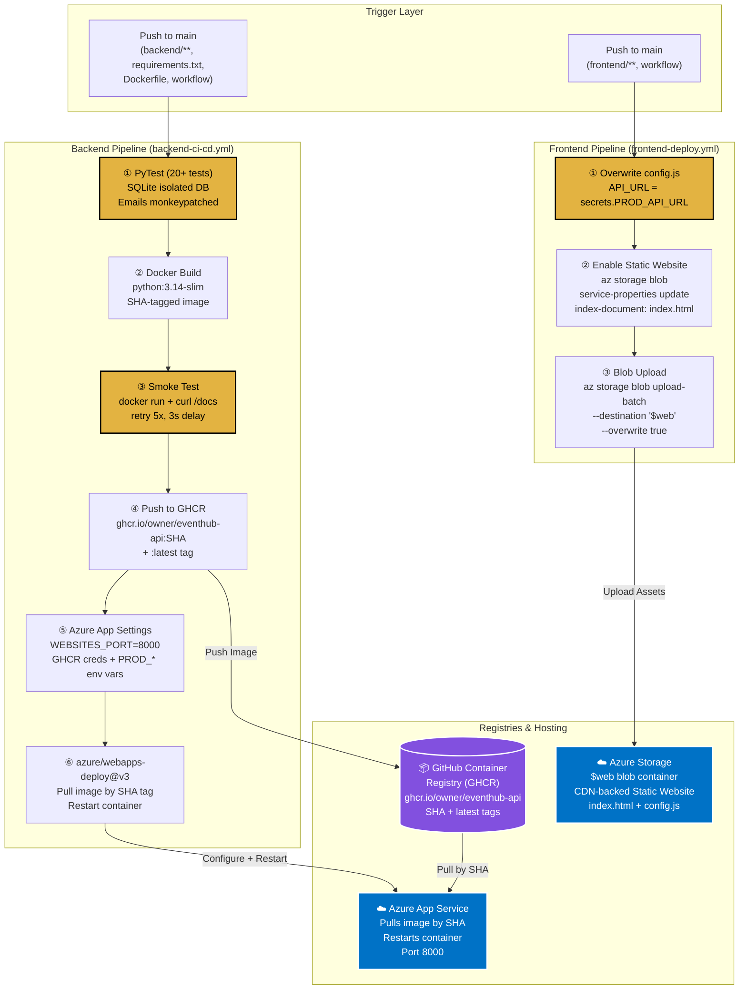
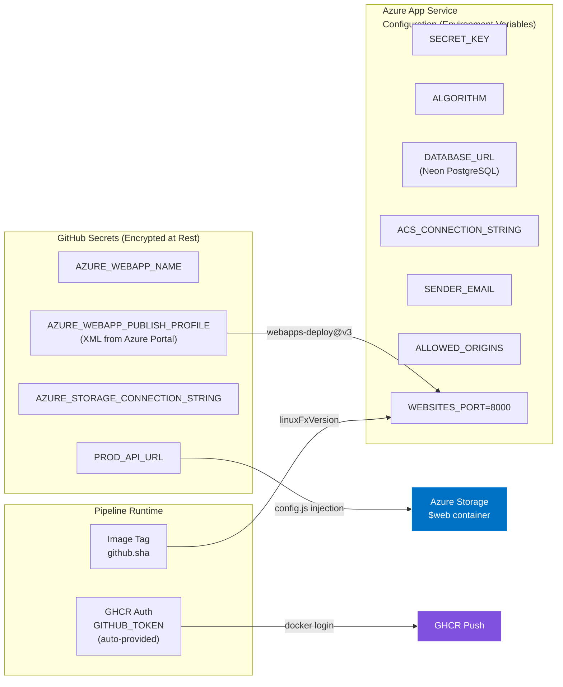

# ADR-004: GitHub Container Registry (GHCR) for Backend Deployment + Github CI/CD Actions for Automation

## Status

**Accepted** — 21 July 2026
**Last Updated** — 23 July 2026 (post-deployment validation with live Azure App Service + Azure Storage)

## Context

EventHub's CI/CD pipeline must solve **two distinct deployment problems** from a single GitHub repository:

| Deployment Target | What Gets Deployed | Hosting Service | Constraint |
|:-----------------|:-------------------|:---------------|:-----------|
| **Backend** | A Dockerised FastAPI application (Python 3.14, Uvicorn, port 8000) | Azure App Service for Containers | Must pull a container image from a registry. Must be **100% free**. |
| **Frontend** | Pure static assets (HTML, CSS, Vanilla JS, `config.js`) | Azure Storage Account — Static Website hosting | Must upload files to the `$web` blob container. Must inject the production API URL at deploy time. |

### The Container Registry Problem

Azure App Service for Containers requires a **container image hosted in a registry** it can pull from. The registry must satisfy:

| # | Requirement | Source |
|---|:-----------|:-------|
| 1 | Must be **100% free** for the project lifecycle (no credit card, no trial expiry) | Deliverables Spec — free-tier constraint |
| 2 | Must integrate natively with **GitHub Actions** (the CI/CD platform) | `backend-ci-cd.yml` workflow |
| 3 | Must support **immutable image tags** (SHA-based) for reproducible deployments | Production safety — no "latest" tag ambiguity |
| 4 | Must support **private images** (Azure App Service pulls via credentials) | Security — container image contains application code |
| 5 | Must require **zero additional infrastructure** (no separate cloud account, no CLI setup) | Reviewer onboarding < 20 min |
| 6 | Must work with `azure/webapps-deploy@v3` GitHub Action | Azure's official deployment action |

### The Frontend Deployment Problem

The frontend is **pure static files** (~50KB total). It does not need a container, a server process, or a build step. The deployment must:

| # | Requirement | Source |
|---|:-----------|:-------|
| 1 | Upload HTML/CSS/JS to Azure Storage's `$web` blob container | Azure Static Website hosting |
| 2 | **Overwrite `config.js`** with the production API URL before upload | `frontend-deploy.yml` — the only difference between local and production |
| 3 | Enable the Static Website feature on the Storage Account (idempotent) | First-time setup via `az storage blob service-properties update` |
| 4 | Require **zero build tools** (no Node.js, no npm, no bundler) | ADR-001 — zero build step constraint |

### The Core Tension

The backend needs a **container registry** (a service that stores and serves Docker images). The frontend needs a **blob storage upload** (a service that stores and serves static files). These are fundamentally different deployment mechanisms, yet both must be triggered from the same GitHub repository, use the same secrets infrastructure, and cost $0.

## Decision

**Chosen: GitHub Container Registry (GHCR) for the backend Docker image + Azure Storage Blob Upload for the frontend static assets, orchestrated by two independent GitHub Actions workflows.**

### Architecture of the Deployment Pipeline



### Why GHCR Specifically

GHCR is GitHub's **built-in container registry**, available to every GitHub repository (public and private) at no additional cost. It is not a separate service — it is part of the GitHub platform that already hosts the source code, the CI/CD workflows, and the issue tracker.

| Feature | GHCR | Docker Hub (Free) | Azure ACR (Free) | AWS ECR | GCR |
|:--------|:----:|:-----------------:|:----------------:|:-------:|:---:|
| Cost | **$0** | $0 (1 private repo) | $0 (Basic, 100MB) | $0 (12-mo trial) | $0 (12-mo trial) |
| Credit card required | **No** | No | **Yes** | **Yes** | **Yes** |
| GitHub Actions integration | **Native** (`GITHUB_TOKEN`) | Requires PAT | Requires `az acr login` | Requires AWS creds | Requires GCP creds |
| Private image support | **Yes** (via `packages: write`) | 1 repo only | Yes | Yes | Yes |
| SHA-tagged immutable images | **Yes** | Yes | Yes | Yes | Yes |
| Separate account needed | **No** (same GitHub login) | Yes (Docker ID) | Yes (Azure sub) | Yes (AWS acct) | Yes (GCP proj) |
| `azure/webapps-deploy@v3` compatible | **Yes** (via `DOCKER_REGISTRY_SERVER_URL`) | Yes | Yes (native) | Yes | Yes |
| Storage limit | **500MB free** | Unlimited (public) | 100MB (Basic) | 500MB (trial) | 5GB (trial) |
| Trial expiry | **Never** | Never | Never (Basic) | 12 months | 12 months |

### How Azure App Service Pulls from GHCR

Azure App Service does not natively "know" about GHCR. It is configured via **application settings** that tell it where to find the image and how to authenticate:

| App Setting | Value | Purpose |
|:-----------|:------|:--------|
| `DOCKER_REGISTRY_SERVER_URL` | `https://ghcr.io` | Tells Azure the registry endpoint |
| `DOCKER_REGISTRY_SERVER_USERNAME` | `<github-username>` | GHCR authentication (lowercase owner) |
| `DOCKER_REGISTRY_SERVER_PASSWORD` | `<github-PAT>` or `GITHUB_TOKEN` | GHCR authentication credential |
| `WEBSITES_PORT` | `8000` | Tells Azure which port the container listens on |
| `linuxFxVersion` | `DOCKER\|ghcr.io/owner/eventhub-api:<SHA>` | The exact image to pull (set by `webapps-deploy@v3`) |

The `azure/webapps-deploy@v3` GitHub Action sets `linuxFxVersion` automatically when given the `images:` parameter. The registry credentials are set in the **Configure** step of the pipeline.

### The Smoke Test Gate

Before any image is pushed to GHCR, the pipeline **runs the container locally** and validates it boots correctly:

```yaml
- name: Run container smoke test
  run: |
    docker run -d --name eventhub-smoke \
      -p 8000:8000 \
      -e SECRET_KEY=ci-secret-key \
      -e ALGORITHM=HS256 \
      -e DATABASE_URL=sqlite:///./smoke.db \
      -e ACS_CONNECTION_STRING="endpoint=https://test.communication.azure.com/;accesskey=dGVzdA==" \
      -e SENDER_EMAIL=DoNotReply@test.com \
      -e ALLOWED_ORIGINS="*" \
      ${{ steps.vars.outputs.image }}:${{ github.sha }}
    sleep 10
    curl --fail --retry 5 --retry-delay 3 --retry-connrefused http://localhost:8000/docs
    docker stop eventhub-smoke
    docker rm eventhub-smoke
```

**Why this matters:** A Docker image can build successfully but fail at runtime (missing environment variable, import error, port conflict). The smoke test catches these failures **before** the image reaches GHCR, preventing broken deployments from ever reaching production.

### The SHA-Tagging Strategy

Every image is tagged with the **full Git commit SHA** (`github.sha`), not a mutable tag like `latest`:

```yaml
docker build -t ${{ steps.vars.outputs.image }}:${{ github.sha }} .
docker push ${{ steps.vars.outputs.image }}:${{ github.sha }}
docker tag ${{ steps.vars.outputs.image }}:${{ github.sha }} ${{ steps.vars.outputs.image }}:latest
docker push ${{ steps.vars.outputs.image }}:latest
```

| Tag | Purpose | Mutability |
|:----|:--------|:-----------|
| `ghcr.io/owner/eventhub-api:a1b2c3d4e5f6...` | **Production deployment tag.** Azure App Service pulls this exact image. | **Immutable.** Never overwritten. |
| `ghcr.io/owner/eventhub-api:latest` | Convenience tag for local `docker pull` during development. | Mutable. Overwritten on every push. |

**Why SHA tags:** If a deployment fails, you can **roll back** by redeploying the previous SHA tag. With `latest` alone, you cannot distinguish between the working and broken versions. SHA tags provide a complete, auditable deployment history.

### The Frontend Deployment (No Registry Needed)

The frontend does **not** use a container registry. It is deployed via direct blob upload to Azure Storage:

```yaml
- name: Generate production config.js
  run: |
    echo "window.EVENTHUB_CONFIG = { API_URL: '${{ secrets.PROD_API_URL }}' };" > frontend/config.js

- name: Enable static website if not already enabled
  uses: azure/cli@v2
  with:
    inlineScript: |
      az storage blob service-properties update \
        --connection-string "${{ secrets.AZURE_STORAGE_CONNECTION_STRING }}" \
        --static-website \
        --index-document index.html \
        --404-document index.html || true

- name: Upload frontend to Azure Storage static website
  uses: azure/cli@v2
  with:
    inlineScript: |
      az storage blob upload-batch \
        --connection-string "${{ secrets.AZURE_STORAGE_CONNECTION_STRING }}" \
        --destination '$web' \
        --source frontend \
        --overwrite true
```

**Why not containerise the frontend?** The frontend is 7 static files totalling ~50KB. Wrapping them in an Nginx Docker image would add ~40MB of overhead, require a running container process, and complicate the deployment pipeline — all for serving files that Azure Storage can serve natively via CDN-backed edge caching at $0. The Nginx container is used **only for local development** (via Docker Compose), not for production.

### Concurrency Control

Both workflows use GitHub Actions' `concurrency` feature to prevent parallel deployments:

```yaml
# backend-ci-cd.yml
concurrency:
  group: backend-production
  cancel-in-progress: false

# frontend-deploy.yml
concurrency:
  group: frontend-production
  cancel-in-progress: false
```

| Setting | Value | Rationale |
|:--------|:------|:----------|
| `group` | `backend-production` / `frontend-production` | Groups all runs of the same workflow. Only one runs at a time. |
| `cancel-in-progress` | `false` | Does **not** cancel a running deployment when a new push arrives. The current deployment finishes first. Prevents half-deployed states. |

### Secrets & Variables Architecture

The deployment pipeline uses a **layered secrets architecture** that separates GitHub-level secrets from Azure-level configuration:



| Secret | Stored In | Used By | Never Exposed In |
|:-------|:----------|:--------|:-----------------|
| `AZURE_WEBAPP_PUBLISH_PROFILE` | GitHub Secrets | `azure/webapps-deploy@v3` | Logs, code, `.env` |
| `AZURE_STORAGE_CONNECTION_STRING` | GitHub Secrets | `azure/cli@v2` (frontend upload) | Logs, code, `.env` |
| `PROD_API_URL` | GitHub Secrets | `frontend-deploy.yml` (config.js injection) | Committed `config.js` |
| `SECRET_KEY` | Azure App Settings | FastAPI runtime (JWT signing) | GitHub, code, `.env.example` |
| `DATABASE_URL` | Azure App Settings | FastAPI runtime (Neon connection) | GitHub, code, `.env.example` |
| `ACS_CONNECTION_STRING` | Azure App Settings | FastAPI runtime (email delivery) | GitHub, code, `.env.example` |
| `GITHUB_TOKEN` | Auto-provided by Actions | `docker/login-action@v3` (GHCR auth) | N/A (ephemeral, per-run) |

### The Two-Workflow Independence

The backend and frontend pipelines are **completely independent**:

| Aspect | Backend (`backend-ci-cd.yml`) | Frontend (`frontend-deploy.yml`) |
|:-------|:-----------------------------|:--------------------------------|
| **Trigger paths** | `backend/**`, `requirements.txt`, `Dockerfile`, workflow file | `frontend/**`, workflow file |
| **Can run in parallel?** | Yes | Yes |
| **Jobs** | 3 (test → build-smoke-push → deploy) | 1 (deploy) |
| **Registry involved?** | Yes (GHCR) | No (direct blob upload) |
| **Azure service touched** | App Service (container restart) | Storage Account (blob upload) |
| **Typical duration** | ~3–4 minutes | ~30 seconds |
| **Failure impact** | Backend not updated; frontend unaffected | Frontend not updated; backend unaffected |

This independence means a frontend CSS change does **not** trigger a backend rebuild, and a backend bug fix does **not** re-upload the frontend. Each pipeline only runs when its own files change.

## Consequences

### Positive

| # | Consequence | Impact |
|---|:-----------|:-------|
| 1 | **Zero additional accounts.** GHCR is part of GitHub. No Docker Hub account, no Azure Container Registry, no AWS/GCP credentials. One login for everything. | Reviewer onboarding: **zero registry setup**. |
| 2 | **`GITHUB_TOKEN` is auto-provided.** No personal access token (PAT) needed for GHCR authentication. The token is ephemeral, scoped to the workflow run, and has `packages: write` permission via the workflow's `permissions:` block. | No long-lived credentials to rotate or leak. |
| 3 | **SHA-tagged immutable deployments.** Every production deployment references an exact commit. Rollback = redeploy the previous SHA. Full audit trail in GHCR's package history. | Production safety. No "which `latest` is deployed?" ambiguity. |
| 4 | **Smoke test prevents broken deployments.** The container is run and health-checked (`curl /docs`) before being pushed. A broken image never reaches GHCR or Azure. | Zero-downtime guarantee for the registry. |
| 5 | **Frontend deployment is trivially simple.** Three shell commands: overwrite `config.js`, enable static website, upload blobs. No container, no registry, no build step. | Frontend deploys in **< 30 seconds**. |
| 6 | **Two independent pipelines.** Backend and frontend changes trigger separate workflows. A CSS tweak doesn't rebuild the Docker image. A Python fix doesn't re-upload HTML. | Faster feedback loops. Reduced CI/CD minutes. |
| 7 | **`concurrency: cancel-in-progress: false`** prevents half-deployed states. If two pushes arrive in quick succession, the first deployment finishes before the second starts. | No race conditions in production. |
| 8 | **100% free, forever.** GHCR provides 500MB free storage. Azure Storage Static Website is within the free tier. No credit card, no trial expiry. | Meets the Deliverables Spec constraint with margin. |
| 9 | **`azure/webapps-deploy@v3` is Azure's official action.** Maintained by Microsoft. Handles `linuxFxVersion`, container pull, and restart automatically. | No custom deployment scripts. Battle-tested action. |
| 10 | **The entire pipeline is declarative YAML.** Two files in `.github/workflows/`. Version-controlled, diffable, reviewable. No Jenkins, no CircleCI, no external CI service. | Infrastructure-as-code for the deployment pipeline itself. |

### Negative

| # | Consequence | Mitigation |
|---|:-----------|:-----------|
| 1 | **GHCR is GitHub-specific.** Migrating CI/CD to GitLab CI, Jenkins, or CircleCI would require switching to a different registry (Docker Hub, ACR, etc.). | Acceptable for a single-platform project. The Dockerfile is registry-agnostic — only the `docker push` target changes. |
| 2 | **500MB GHCR storage limit.** Each image is ~180MB. After 2–3 pushes, old images accumulate. | Old untagged images can be cleaned via GitHub's package settings. SHA-tagged images are small enough for the project's lifecycle. |
| 3 | **Azure App Service cold start after image pull.** When Azure pulls a new image from GHCR, the first request takes 30–60 seconds (image pull + container start). | Inherent to App Service Free Tier. Documented in README's "Note" section. `HEALTHCHECK` in Dockerfile helps Azure detect readiness. |
| 4 | **`AZURE_WEBAPP_PUBLISH_PROFILE` is an XML blob.** It contains credentials and must be stored as a GitHub Secret. If the Azure resource is recreated, the publish profile changes and the secret must be updated. | One-time setup. Documented in the CI/CD reference doc. The publish profile can be re-downloaded from Azure Portal → App Service → Get publish profile. |
| 5 | **No image vulnerability scanning.** GHCR does not run automated CVE scans on pushed images (unlike ACR or ECR). | Acceptable for a student project. The base image (`python:3.14-slim`) is maintained by Docker. Dependencies are pinned in `requirements.txt`. |
| 6 | **Frontend has no rollback mechanism.** `az storage blob upload-batch --overwrite true` replaces all files. There is no version history for the `$web` container. | The committed `config.js` in the repo is the source of truth. Re-running the workflow with a previous commit restores the previous frontend. |
| 7 | **`GITHUB_TOKEN` permissions must be explicitly declared.** The workflow needs `permissions: packages: write` to push to GHCR. Forgetting this causes a silent auth failure. | Declared in the workflow YAML. Documented in the CI/CD reference doc. |

### Neutral

| # | Observation |
|---|:-----------|
| 1 | The `latest` tag is pushed alongside the SHA tag purely for developer convenience (`docker pull ghcr.io/owner/eventhub-api:latest`). Production **always** deploys by SHA. |
| 2 | The frontend pipeline uses `azure/cli@v2` (Azure CLI in a GitHub Action) rather than a dedicated Azure Storage action. This is because the CLI provides the most flexible interface for `blob upload-batch` and `service-properties update`. |
| 3 | The `|| true` on the "Enable static website" step makes it **idempotent**. It runs on every deployment but only has an effect the first time. Subsequent runs are no-ops. |
| 4 | The `tr '[:upper:]' '[:lower:]'` in the pipeline lowercases the GitHub owner name because GHCR requires lowercase image paths. This handles repositories owned by users with capital letters in their username. |
| 5 | The two workflows share the same trigger branch (`main`) but different `paths:` filters. This is GitHub Actions' built-in path-based filtering — no custom logic needed. |

## Alternatives Considered

| Alternative | Pros | Cons | Why Rejected |
|:-----------|:-----|:-----|:-------------|
| **Docker Hub (Free Tier)** | Largest public registry. Well-known. Unlimited public images. | Only **1 private repository** on free tier. Requires a separate Docker ID account. No native GitHub Actions integration (requires PAT). Rate limits on pulls (100/6h for anonymous). | Separate account friction. Only 1 private repo. PAT management overhead. GHCR is already part of GitHub. |
| **Azure Container Registry (ACR) — Basic** | Native Azure integration. Managed by Microsoft. Vulnerability scanning. Geo-replication. | Requires an **Azure subscription** (credit card). Basic tier: 100MB storage. Adds a separate Azure resource to manage. `az acr login` step needed in CI/CD. | Violates the "zero additional accounts" principle. Adds Azure resource management overhead. GHCR achieves the same result with zero extra setup. |
| **AWS ECR (Free Tier)** | 500MB free. Native AWS integration. | 12-month trial only. Requires AWS account + IAM credentials. Project is on Azure — cross-cloud registry adds latency and complexity. | Wrong cloud. Trial expires. Cross-cloud authentication complexity. |
| **Google Container Registry (GCR) / Artifact Registry** | 5GB free. Native GCP integration. | 12-month trial. Requires GCP account + service account JSON key. Project is on Azure. | Wrong cloud. Trial expires. Same cross-cloud problems as ECR. |
| **Quay.io (Red Hat)** | Free for public repos. Security scanning. | Private repos require paid plan. No GitHub Actions native integration. Less well-known. | No free private repos. No GitHub-native auth. |
| **GitHub Packages (npm/Maven)** | Native GitHub integration. | Not a container registry. Cannot store Docker images. | Wrong artifact type. |
| **Build & push in a single job (no smoke test)** | Simpler pipeline. Fewer steps. | A broken image reaches GHCR and potentially production. No pre-push validation. | The smoke test is a **critical quality gate**. Skipping it risks deploying a container that builds but doesn't boot. |
| **Deploy backend via `az webapp deploy` (source code, not container)** | No registry needed. Azure builds the image. | Azure's build service is slow, opaque, and hard to debug. No smoke test possible. No SHA-tagged images. Less control over the build environment. | Container-based deployment via GHCR gives full control over the build, test, and push pipeline. |
| **Containerise the frontend (Nginx Docker image → App Service)** | Single deployment mechanism for both tiers. | Adds ~40MB image for 50KB of static files. Requires a running container process. Complicates the pipeline. Costs more (App Service compute for static files). | Static files belong in blob storage, not a container. Azure Storage serves them via CDN at $0 with zero compute. |
| **Vercel / Netlify for frontend** | Excellent DX. Automatic HTTPS. Global CDN. | Separate account. Separate deployment pipeline. Not Azure-native. Adds a third platform to the architecture. | Violates the "single cloud" principle. Azure Storage Static Website achieves the same result within the existing Azure account. |
| **Single workflow for both backend + frontend** | One file to maintain. | A CSS change triggers a full backend rebuild + Docker push + Azure deploy. Wastes CI/CD minutes. Increases deployment risk. | Two independent workflows with path-based triggers are more efficient and safer. |

## Decision Matrix (Weighted Scoring)

| Criterion (Weight) | GHCR + Azure Storage | Docker Hub | ACR (Basic) | AWS ECR | Vercel + GHCR |
|:-------------------|:--------------------:|:----------:|:-----------:|:-------:|:-------------:|
| 100% free forever (25%) | ✅ 5 | ✅ 4 | ⚠️ 3 | ⚠️ 2 | ✅ 4 |
| Zero additional accounts (20%) | ✅ 5 | ⚠️ 3 | ❌ 2 | ❌ 1 | ❌ 2 |
| GitHub Actions integration (20%) | ✅ 5 | ⚠️ 3 | ⚠️ 3 | ⚠️ 3 | ⚠️ 3 |
| Immutable SHA deployments (15%) | ✅ 5 | ✅ 5 | ✅ 5 | ✅ 5 | ✅ 5 |
| Single-cloud consistency (10%) | ✅ 5 | ✅ 4 | ✅ 5 | ❌ 1 | ⚠️ 3 |
| Smoke test + quality gate (10%) | ✅ 5 | ✅ 5 | ✅ 5 | ✅ 5 | ✅ 5 |
| **Weighted Total** | **5.00** | **3.75** | **3.55** | **2.75** | **3.55** |

## Testing Strategy for the Deployment Pipeline

| Test Scenario | How It's Validated | Where |
|:-------------|:-------------------|:------|
| Docker image builds successfully | `docker build` exits with code 0 | `backend-ci-cd.yml` → Build step |
| Container boots and serves the API | `curl --fail --retry 5 http://localhost:8000/docs` returns 200 | `backend-ci-cd.yml` → Smoke test step |
| Image pushes to GHCR | `docker push` exits with code 0; image visible in GitHub Packages tab | `backend-ci-cd.yml` → Push step |
| Azure App Service pulls the new image | App Service restarts; `/docs` returns 200 at the live URL | Manual verification post-deploy |
| Frontend `config.js` is injected | `cat frontend/config.js` in the workflow log shows the production URL | `frontend-deploy.yml` → Config injection step |
| Frontend is accessible at the live URL | Browser loads `index.html` from Azure Storage Static Website | Manual verification post-deploy |
| All 20+ tests pass before build | `pytest -v` exits with code 0 | `backend-ci-cd.yml` → Test job |
| Concurrent pushes don't corrupt deployment | `concurrency: cancel-in-progress: false` queues the second run | GitHub Actions UI → workflow runs |

## References

- `.github/workflows/backend-ci-cd.yml` — Full backend pipeline: PyTest → Docker build → smoke test → GHCR push → Azure deploy
- `.github/workflows/frontend-deploy.yml` — Full frontend pipeline: config.js injection → static website enable → blob upload
- `Dockerfile` — `python:3.14-slim` base, `HEALTHCHECK`, `EXPOSE 8000`, `uvicorn` CMD
- `docker-compose.yml` — Local development stack (PostgreSQL + FastAPI + Nginx); Nginx is **not** used in production
- `frontend/config.js` — Runtime API URL injection; empty in repo, overwritten by CI/CD
- GitHub Secret: `AZURE_WEBAPP_PUBLISH_PROFILE` — XML publish profile from Azure Portal (never committed)
- GitHub Secret: `AZURE_STORAGE_CONNECTION_STRING` — Azure Storage Account connection string (never committed)
- GitHub Secret: `PROD_API_URL` — Azure Web App URL injected into `config.js` (never committed)
- Azure App Service Configuration: `WEBSITES_PORT=8000`, `DOCKER_REGISTRY_SERVER_URL=https://ghcr.io`, `SECRET_KEY`, `DATABASE_URL`, `ACS_CONNECTION_STRING`, `SENDER_EMAIL`, `ALLOWED_ORIGINS`, `ALGORITHM`
- `docs/design_doc.md` → Section 7 — CI/CD Deployment Strategy (pipeline stage tables)
- ADR-001 — Decoupled Vanilla JS Frontend (explains why the frontend is static files, not a container)
- ADR-002 — Neon PostgreSQL (explains the `DATABASE_URL` that gets injected into Azure App Settings)
- ADR-003 — Azure Communication Services (explains the `ACS_CONNECTION_STRING` that gets injected into Azure App Settings)
```
