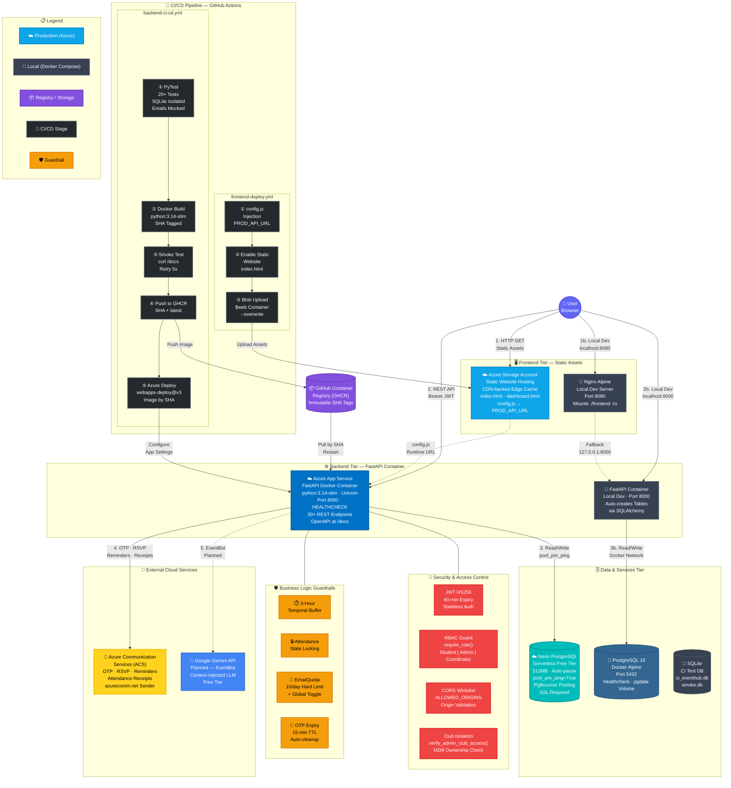

# 🏗️ EventHub — Comprehensive Architecture Diagram

```mermaid
graph TD
    %% ===================== STYLES =====================
    classDef user fill:#6366f1,stroke:#4f46e5,stroke-width:2px,color:#fff
    classDef frontend fill:#0ea5e9,stroke:#0284c7,stroke-width:2px,color:#fff
    classDef backend fill:#0072C6,stroke:#005a9e,stroke-width:2px,color:#fff
    classDef database fill:#00bcba,stroke:#009694,stroke-width:2px,color:#fff
    classDef localdb fill:#336791,stroke:#265380,stroke-width:2px,color:#fff
    classDef cicd fill:#24292e,stroke:#57606a,stroke-width:2px,color:#fff
    classDef registry fill:#8250df,stroke:#6639ba,stroke-width:2px,color:#fff
    classDef email fill:#FFD21E,stroke:#e6b800,stroke-width:2px,color:#000
    classDef ai fill:#4285F4,stroke:#3367d6,stroke-width:2px,color:#fff
    classDef security fill:#ef4444,stroke:#dc2626,stroke-width:2px,color:#fff
    classDef guardrail fill:#f59e0b,stroke:#d97706,stroke-width:2px,color:#000
    classDef local fill:#374151,stroke:#4b5563,stroke-width:2px,color:#fff

    %% ===================== USER LAYER =====================
    User(("👤 User<br/>Browser")):::user

    %% ===================== FRONTEND TIER =====================
    subgraph FE_TIER["🖥️ Frontend Tier — Static Assets"]
        direction TB
        SWA["☁️ Azure Storage Account<br/>Static Website Hosting<br/>CDN-backed Edge Cache<br/>index.html · dashboard.html<br/>config.js → PROD_API_URL"]:::frontend
        NGINX["🐳 Nginx Alpine<br/>Local Dev Server<br/>Port 8080<br/>Mounts ./frontend :ro"]:::local
    end

    %% ===================== SECURITY LAYER =====================
    subgraph SEC_LAYER["🔐 Security & Access Control"]
        direction LR
        JWT["JWT HS256<br/>60-min Expiry<br/>Stateless Auth"]:::security
        RBAC["RBAC Guard<br/>require_role()<br/>Student | Admin | Coordinator"]:::security
        CORS["CORS Whitelist<br/>ALLOWED_ORIGINS<br/>Origin Validation"]:::security
        CLUB_ISO["Club Isolation<br/>verify_admin_club_access()<br/>M2M Ownership Check"]:::security
    end

    %% ===================== BACKEND TIER =====================
    subgraph BE_TIER["⚙️ Backend Tier — FastAPI Container"]
        direction TB
        API_PROD["☁️ Azure App Service<br/>FastAPI Docker Container<br/>python:3.14-slim · Uvicorn<br/>Port 8000 · HEALTHCHECK<br/>30+ REST Endpoints<br/>OpenAPI at /docs"]:::backend
        API_LOCAL["🐳 FastAPI Container<br/>Local Dev · Port 8000<br/>Auto-creates Tables<br/>via SQLAlchemy"]:::local
    end

    %% ===================== GUARDRAILS =====================
    subgraph GUARDRAILS["🛡️ Business Logic Guardrails"]
        direction LR
        TEMPORAL["⏱️ 3-Hour<br/>Temporal Buffer"]:::guardrail
        STATE_LOCK["🔒 Attendance<br/>State Locking"]:::guardrail
        QUOTA["📧 EmailQuota<br/>10/day Hard Limit<br/>+ Global Toggle"]:::guardrail
        OTP_GUARD["🔑 OTP Expiry<br/>15-min TTL<br/>Auto-cleanup"]:::guardrail
    end

    %% ===================== DATA TIER =====================
    subgraph DATA_TIER["🗄️ Data & Services Tier"]
        direction TB
        NEON[("☁️ Neon PostgreSQL<br/>Serverless Free Tier<br/>512MB · Auto-pause<br/>pool_pre_ping=True<br/>PgBouncer Pooling<br/>SSL Required")]:::database
        PG_LOCAL[("🐳 PostgreSQL 16<br/>Docker Alpine<br/>Port 5432<br/>Healthcheck · pgdata Volume")]:::localdb
        SQLITE[("🧪 SQLite<br/>CI Test DB<br/>ci_eventhub.db<br/>smoke.db")]:::local
    end

    %% ===================== EXTERNAL SERVICES =====================
    subgraph EXT_SERVICES["📡 External Cloud Services"]
        direction TB
        ACS["📧 Azure Communication<br/>Services (ACS)<br/>OTP · RSVP · Reminders<br/>Attendance Receipts<br/>azurecomm.net Sender"]:::email
        GEMINI["🤖 Google Gemini API<br/>Planned — EventBot<br/>Context-Injected LLM<br/>Free Tier"]:::ai
    end

    %% ===================== CI/CD PIPELINE =====================
    subgraph CICD["🔄 CI/CD Pipeline — GitHub Actions"]
        direction TB
        subgraph BE_PIPE["backend-ci-cd.yml"]
            direction LR
            TEST["① PyTest<br/>20+ Tests<br/>SQLite Isolated<br/>Emails Mocked"]:::cicd
            BUILD["② Docker Build<br/>python:3.14-slim<br/>SHA Tagged"]:::cicd
            SMOKE["③ Smoke Test<br/>curl /docs<br/>Retry 5x"]:::cicd
            PUSH["④ Push to GHCR<br/>SHA + latest"]:::cicd
            DEPLOY_BE["⑤ Azure Deploy<br/>webapps-deploy@v3<br/>Image by SHA"]:::cicd
        end
        subgraph FE_PIPE["frontend-deploy.yml"]
            direction LR
            INJECT["① config.js<br/>Injection<br/>PROD_API_URL"]:::cicd
            ENABLE["② Enable Static<br/>Website<br/>index.html"]:::cicd
            UPLOAD["③ Blob Upload<br/>$web Container<br/>--overwrite"]:::cicd
        end
    end

    GHCR[("📦 GitHub Container<br/>Registry (GHCR)<br/>Immutable SHA Tags")]:::registry

    %% ===================== ROUTING =====================
    User -->|"1. HTTP GET<br/>Static Assets"| SWA
    User -->|"1b. Local Dev<br/>localhost:8080"| NGINX
    User -->|"2. REST API<br/>Bearer JWT"| API_PROD
    User -->|"2b. Local Dev<br/>localhost:8000"| API_LOCAL

    SWA -.->|"config.js<br/>Runtime URL"| API_PROD
    NGINX -.->|"Fallback<br/>127.0.0.1:8000"| API_LOCAL

    API_PROD -->|"3. Read/Write<br/>pool_pre_ping"| NEON
    API_LOCAL -->|"3b. Read/Write<br/>Docker Network"| PG_LOCAL

    API_PROD -->|"4. OTP · RSVP<br/>Reminders · Receipts"| ACS
    API_PROD -.->|"5. EventBot<br/>Planned"| GEMINI

    API_PROD --- SEC_LAYER
    API_PROD --- GUARDRAILS

    %% CI/CD Flow
    TEST --> BUILD --> SMOKE --> PUSH --> DEPLOY_BE
    PUSH -->|"Push Image"| GHCR
    GHCR -->|"Pull by SHA<br/>Restart"| API_PROD
    DEPLOY_BE -->|"Configure<br/>App Settings"| API_PROD

    INJECT --> ENABLE --> UPLOAD
    UPLOAD -->|"Upload Assets"| SWA

    %% ===================== LEGEND =====================
    subgraph LEGEND["📋 Legend"]
        direction LR
        L1["☁️ Production (Azure)"]:::frontend
        L2["🐳 Local (Docker Compose)"]:::local
        L3["📦 Registry / Storage"]:::registry
        L4["🔄 CI/CD Stage"]:::cicd
        L5["🛡️ Guardrail"]:::guardrail
    end
```
