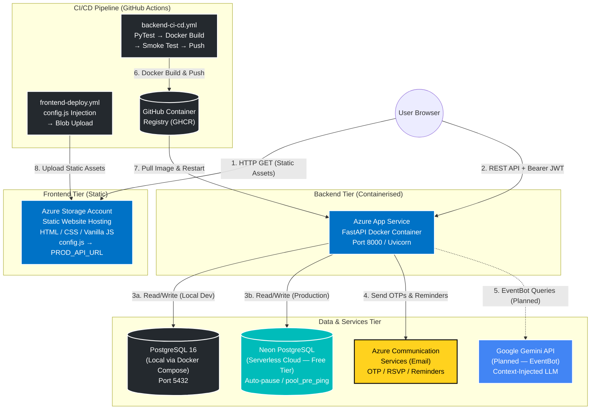
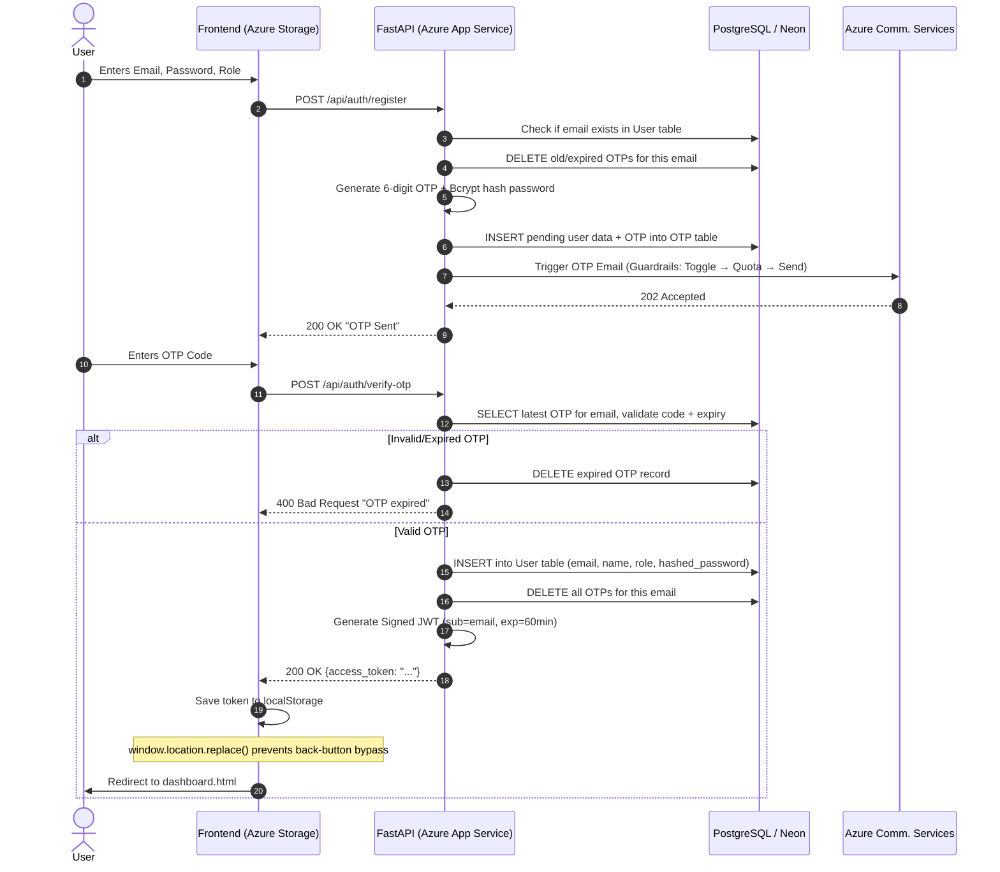
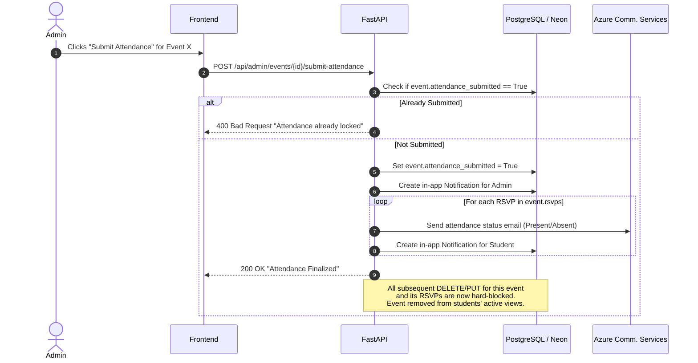
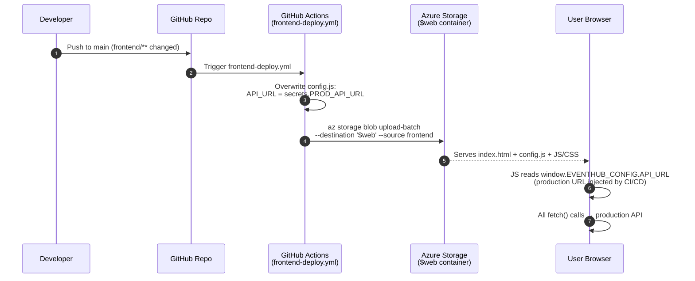
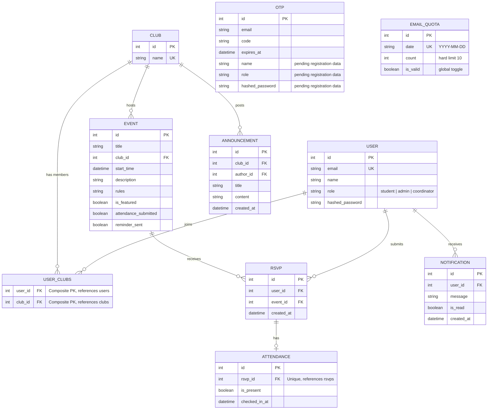
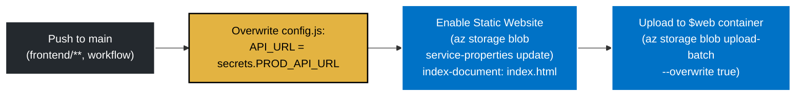

# Architecture Design Document: EventHub

**Author:** Dhruv Puri  
**Date:** 18 July 2026 *(Updated: 21 July 2026)*  
**Segment:** Segment 4 — Foundations of Cloud & DevOps  
**Problem Statement:** J2 — Internal Tool Backbone  

---

## 1. System Overview

EventHub is an internal event management tool built to streamline how university student clubs organize gatherings, manage RSVPs, and track attendance. It replaces chaotic WhatsApp/Google Form workflows with a centralized, role-based platform serving three distinct user personas: **Students** (browse, RSVP, receive notifications), **Club Admins** (create events, manage attendance, export reports), and **Student Affairs Coordinators** (manage clubs, assign admins, view institutional analytics).

**Week 3 Mini-Extension (Automated Notifications):** The platform extends standard CRUD operations by integrating a production-grade transactional email pipeline using **Azure Communication Services (ACS)**. This powers secure OTP-based user registration, password resets, automated RSVP confirmations, 24-hour event reminders, and attendance finalization receipts. To prevent API abuse during demos, the system is protected by a custom `EmailQuota` database guardrail (hard limit: 10 emails/day) and a global frontend toggle switch that defaults to OFF on page load.

**AI Extension (EventBot):** A lightweight `/api/bot/ask` endpoint provides students with instant answers to common event queries. Currently rule-based (keyword matching against club handbooks), with a planned upgrade to the **Google Gemini Free API** for context-aware responses about event rules, requirements, and club guidelines. The Gemini integration will inject live event context (title, rules, description) into the prompt, replacing the earlier RAG/HuggingFace Spaces plan to stay within the 100% free-tier constraint.

**Containerisation & Local Development:** The entire stack (PostgreSQL 16 + FastAPI + Nginx frontend) runs with a single `docker-compose up --build` command. A runtime `config.js` injection pattern allows the same frontend codebase to work locally (fallback to `localhost:8000`) and in production (CI/CD injects the Azure Web App URL at deploy time) without any manual configuration.

---

## 2. Cloud Infrastructure Topology

The system uses a highly decoupled, cloud-native architecture. Frontend assets are served via Azure Storage's CDN-backed Static Website hosting, the API handles business logic and authentication inside a Docker container on Azure App Service, and external cloud services handle specialised workloads (email delivery, database hosting).



### Deployment Environments

| Environment | Database | Frontend | Backend | Email |
| :--- | :--- | :--- | :--- | :--- |
| **Local (Docker Compose)** | PostgreSQL 16 (Docker service, port 5432) | Nginx (port 8080, mounts `./frontend` read-only) | FastAPI container (port 8000) | ACS (if configured) or console stub |
| **Production (Azure)** | Neon PostgreSQL (Serverless, `pool_pre_ping=True`) | Azure Storage Static Website (`config.js` injected by CI/CD) | Azure App Service (GHCR image, port 8000) | Azure Communication Services |
| **CI/CD Tests (GitHub Actions)** | SQLite (`ci_eventhub.db`, isolated) | N/A | Pytest + Docker smoke test (`smoke.db`) | Monkeypatched (no real emails) |

---

## 3. Tech Stack Matrix

| Component | Technology | Rationale |
| :--- | :--- | :--- |
| **Backend API** | FastAPI (Python 3.14) | High-throughput asynchronous framework with native Pydantic validation, dependency injection, and auto-generated OpenAPI documentation at `/docs`. |
| **Database (Local)** | PostgreSQL 16 (Docker Alpine) | Enterprise-grade relational engine running inside Docker Compose. Zero-config local setup with health checks and persistent volumes. |
| **Database (Cloud)** | Neon PostgreSQL (Serverless Free Tier) | 512MB storage, auto-pause/resume, standard `postgresql://` connection string. Chosen over Azure Database for PostgreSQL to strictly adhere to the 100% free-tier constraint. `pool_pre_ping=True` handles cold-start latency. |
| **Frontend** | HTML / CSS / Vanilla JS | Zero-dependency, lightweight static assets (~50KB total). Runtime `config.js` injection pattern for environment portability. Five themes via CSS variables. |
| **Authentication** | JWT (HS256) + Bcrypt + OTP | Secure, stateless token-based security (60-min expiry) paired with time-bound OTP verification (15-min expiry) to prevent database bloat from unverified accounts. |
| **Notification Engine** | Azure Communication Services (ACS) | Native Azure integration for transactional emails. No domain-verification friction (uses `azurecomm.net` sender). Protected by `EmailQuota` guardrail (10/day) and global toggle. |
| **AI Engine (Planned)** | Google Gemini API (Free Tier) | Context-injected LLM for EventBot. Replaces earlier RAG/HuggingFace Spaces plan. Injects live event data (title, rules, description) into prompts for accurate answers. |
| **Containerisation** | Docker + Docker Compose | Single `docker-compose up --build` command spins up the full stack (PostgreSQL + FastAPI + Nginx). Dockerfile uses `python:3.14-slim` with health checks. |
| **Container Registry** | GitHub Container Registry (GHCR) | Stores production Docker images. Azure App Service pulls images by SHA tag. Supports both public and private registries via `GHCR_PRIVATE` variable. |
| **Cloud Hosting** | Azure PaaS (App Service + Storage) | Platform-as-a-Service deployment that cleanly decouples frontend (Storage Static Website) and backend (App Service for Containers) infrastructure. |
| **ORM** | SQLAlchemy 2.0 | Declarative models, relationship management, session handling. `ConfigDict(from_attributes=True)` bridges ORM ↔ Pydantic. |
| **Testing** | Pytest + FastAPI TestClient | 6 test files, 20+ test cases. Isolated SQLite test database. Email calls monkeypatched. Runs in < 5 seconds. |
| **CI/CD** | GitHub Actions (2 workflows) | `backend-ci-cd.yml`: PyTest → Docker build → smoke test → GHCR push → Azure deploy. `frontend-deploy.yml`: `config.js` injection → Azure Storage blob upload. |

---

## 4. Core System Flows

### Flow A: Stateless Authentication & OTP Verification

This flow details how the decoupled frontend securely handles registration via OTP, stores the JWT, and routes the user without leaving traces in the browser history stack.



### Flow B: Event Lifecycle & Guardrails

This flow demonstrates how the system prevents data corruption once an event's attendance is finalized, and how the dual-channel notification system (email + in-app) keeps all stakeholders informed.



### Flow C: Frontend Config Injection (Deploy Time)

This flow shows how the same frontend codebase works in both local and production environments without any manual configuration.



**Local (Docker Compose):** `config.js` ships with `API_URL: ""` → JS falls back to `http://127.0.0.1:8000` → matches Docker Compose port mapping. **Zero configuration needed.**

---

## 5. Database Schema & Entity Relationships

The PostgreSQL database (local Docker or Neon cloud) enforces relational integrity across 10 tables. The following Entity-Relationship (ER) diagram maps the cardinality, including the M2M join table, OTP staging table, notification system, announcements, and email quota guardrail.




### Key Schema Design Decisions

| Decision | Rationale |
| :--- | :--- |
| **`user_clubs` M2M join table** | Students join multiple clubs; admins are assigned to multiple clubs. SQLAlchemy `relationship(secondary=user_clubs)` handles both directions. |
| **`OTP` table stores pending registration data** | Unverified users never enter the `User` table. Prevents database bloat. OTP records self-clean on verification or expiry. Reused for password resets with dummy `name="FORGOT"` fields. |
| **`ATTENDANCE.rsvp_id` is `unique=True`** | One attendance record per RSVP. Enforced at the DB level. Cascade delete from RSVP → Attendance. |
| **`EVENT.attendance_submitted` boolean** | State-locking flag. Once `True`, all DELETE/PUT operations on the event and its RSVPs are hard-blocked at the API level. |
| **`EVENT.reminder_sent` boolean** | Prevents duplicate 24-hour reminder emails. Set to `True` after the reminder batch is sent. |
| **`EMAIL_QUOTA.date` is `unique=True`** | One quota record per day (`YYYY-MM-DD`). Resets naturally via new date string. No cron job needed. |
| **`EMAIL_QUOTA.is_valid` boolean** | Global toggle for the email pipeline. Controlled via `PUT /api/system/toggle-email` and the frontend toggle switch. |
| **Cascade deletes** | `Event.rsvps` → `cascade="all, delete-orphan"`. `RSVP.attendance` → `cascade="all, delete-orphan"`. `Club.announcements` → `cascade="all, delete-orphan"`. Prevents orphaned records. |

---

## 6. Security & Governance Posture

To ensure platform integrity and data privacy, EventHub implements security at multiple layers:

1. **Network Level (CORS):** The FastAPI backend explicitly defines allowed origins via the `ALLOWED_ORIGINS` environment variable. In production, only the Azure Storage Static Website domain (e.g., `https://<account>.z13.web.core.windows.net`) is whitelisted. In local development, `localhost:8080` and `127.0.0.1:8080` are allowed. This mitigates unauthorised cross-origin API access.

2. **Data Layer (Cryptographic Hashing):** All passwords are one-way hashed using `Bcrypt` with a dynamic salt via `passlib.CryptContext` before reaching the database. Plain-text passwords never persist in memory post-validation. The `verify_password()` function handles constant-time comparison.

3. **Session Layer (Stateless Auth):** JSON Web Tokens (JWT) are signed using a server-side secret (`HS256`) with a strict 60-minute expiration payload. The `get_current_user` dependency decodes and validates the token on every protected request. Stale sessions are automatically invalidated without server-side session storage.

4. **Role-Based Access Control (RBAC):** The `require_role(required_role)` dependency factory enforces role checks at the endpoint level. Students cannot access admin or coordinator endpoints (403). Coordinators cannot access admin-only event management endpoints.

5. **Club Isolation (`verify_admin_club_access`):** Admins can only manage events for clubs they are explicitly assigned to. The function checks `admin.clubs` (M2M relationship) against the event's `club_id`. An admin assigned to "Tech Club" cannot create, edit, or delete events for "Lit Club" (403).

6. **Business Logic Guardrails:**
   - **Temporal Buffers:** Events cannot be created or edited to start less than 3 hours from the current time. Enforced in both `create_event` and `update_event` endpoints.
   - **State Locking:** Once `attendance_submitted` is `True`, all `DELETE` and `PUT` requests for that event, its RSVPs, and its attendance records are hard-blocked at the API level (400).
   - **Past Event Protection:** Students cannot RSVP to events whose `start_time` has passed. The `cleanup_past_events()` function auto-removes expired events and notifies affected users.
   - **Duplicate Prevention:** Duplicate registrations (400), duplicate RSVPs (400), and duplicate club names (400) are all blocked at the API level.

7. **Abuse Prevention (Email Pipeline):**
   - **`EmailQuota` model:** Hard-limits outbound ACS emails to 10 per day per deployment. Once exceeded, emails are logged to console instead of sent.
   - **Global Toggle:** `PUT /api/system/toggle-email?toggle=true|false` and a frontend toggle switch (defaults to OFF on page load) allow instantly disabling the entire email pipeline for demo environments.
   - **Exception Handling:** If ACS is unreachable, the `try/except` block catches the error, logs it, and continues. The application never crashes due to email delivery failure.

8. **Environment Isolation:** All sensitive credentials (`SECRET_KEY`, `DATABASE_URL`, `ACS_CONNECTION_STRING`, `SENDER_EMAIL`) are stored in environment variables. The `.env.example` file ships with empty values. Docker Compose overrides with safe local defaults. GitHub Secrets hold production values. No secrets are committed to version control.

---

## 7. CI/CD Deployment Strategy (DevOps Core)

As a Cloud & DevOps-focused project, manual deployments are replaced by two automated GitHub Actions pipelines that trigger on pushes to `main`.

### Backend Pipeline (`backend-ci-cd.yml`)

```mermaid
graph LR
    classDef git fill:#24292e,stroke:#fff,stroke-width:2px,color:#fff;
    classDef test fill:#e3b341,stroke:#000,stroke-width:2px,color:#000;
    classDef build fill:#0072C6,stroke:#fff,stroke-width:2px,color:#fff;
    classDef deploy fill:#10b981,stroke:#fff,stroke-width:2px,color:#fff;

    Push["Push to main<br/>(backend/**, requirements.txt,<br/>Dockerfile, workflow)"]:::git
    Push --> Test["Job 1: Run PyTest<br/>(SQLite isolated DB,<br/>emails monkeypatched)"]:::test
    Test -->|"All 20+ tests pass"| Build["Job 2: Build Docker Image<br/>(python:3.14-slim)"]:::build
    Build --> Smoke["Smoke Test:<br/>docker run + curl /docs<br/>(retry 5x, 3s delay)"]:::test
    Smoke -->|"Container healthy"| PushGHCR["Push to GHCR<br/>(SHA tag + latest)"]:::build
    PushGHCR --> Settings["Set Azure App Settings<br/>(WEBSITES_PORT, GHCR creds,<br/>PROD_* env vars from Secrets)"]:::deploy
    Settings --> Deploy["Deploy to Azure App Service<br/>(azure/webapps-deploy@v3,<br/>image:SHA)"]:::deploy
```



**Backend Pipeline Stages:**

| Stage | What Happens | Key Detail |
| :--- | :--- | :--- |
| **1. Trigger** | Activated on pushes to `main` that touch `backend/**`, `requirements.txt`, `Dockerfile`, or the workflow file. Also supports `workflow_dispatch` for manual runs. | `concurrency: backend-production` prevents parallel deployments. |
| **2. Test** | Runs `pytest -v` against an isolated SQLite database (`ci_eventhub.db`). All email calls are monkeypatched to no-ops. | 20+ tests across 6 files. Runs in < 5 seconds. |
| **3. Build** | Builds the Docker image from the root `Dockerfile`. Tags with `github.sha`. | `python:3.14-slim` base. Only `backend/app` copied (not tests, docs, frontend). |
| **4. Smoke Test** | Runs the container with `DATABASE_URL=sqlite:///./smoke.db`, waits 10s, then `curl --fail --retry 5 http://localhost:8000/docs`. | Validates the image actually boots and serves the API before pushing. |
| **5. Push** | Pushes to GHCR with both SHA tag and `latest` tag. | Lowercase owner via `tr '[:upper:]' '[:lower:]'`. |
| **6. Configure** | Sets Azure App Service settings: `WEBSITES_PORT=8000`, `DOCKER_REGISTRY_SERVER_URL=https://ghcr.io`, and all `PROD_*` environment variables from GitHub Secrets. | Conditional: `GHCR_PRIVATE` variable controls whether pull credentials are set. `SET_PROD_ENV_FROM_SECRETS` controls whether prod env vars are injected. |
| **7. Deploy** | `azure/webapps-deploy@v3` triggers Azure App Service to pull the new image and restart. | Image referenced by SHA tag for immutable deployments. |

### Frontend Pipeline (`frontend-deploy.yml`)



**Frontend Pipeline Stages:**

| Stage | What Happens | Key Detail |
| :--- | :--- | :--- |
| **1. Trigger** | Activated on pushes to `main` that touch `frontend/**` or the workflow file. | Independent from backend pipeline. Can run in parallel. |
| **2. Config Injection** | Overwrites `frontend/config.js` with `window.EVENTHUB_CONFIG = { API_URL: '<PROD_API_URL>' };` using the GitHub Secret. | The committed `config.js` has `API_URL: ""` for local Docker Compose fallback. This step is the **only** difference between local and production frontend. |
| **3. Enable Static Website** | Runs `az storage blob service-properties update --static-website --index-document index.html --404-document index.html`. | Idempotent (`|| true`). Only needs to run once but safe to repeat. |
| **4. Upload** | `az storage blob upload-batch --destination '$web' --source frontend --overwrite true`. | Uploads all files (HTML, CSS, JS, config.js) to the `$web` container. Overwrites previous version. |

### Secrets & Variables Required

| Type | Name | Purpose |
| :--- | :--- | :--- |
| **Secret** | `PROD_API_URL` | Azure Web App URL (e.g., `https://eventhub-api.azurewebsites.net`). Injected into `config.js`. |
| **Secret** | `AZURE_WEBAPP_NAME` | Azure App Service resource name. |
| **Secret** | `AZURE_WEBAPP_PUBLISH_PROFILE` | XML publish profile from Azure Portal. |
| **Secret** | `AZURE_STORAGE_CONNECTION_STRING` | Azure Storage Account connection string. |
| **Secret** | `PROD_SECRET_KEY` | JWT signing secret for production. |
| **Secret** | `PROD_ALGORITHM` | JWT algorithm (e.g., `HS256`). |
| **Secret** | `PROD_DATABASE_URL` | Neon PostgreSQL connection string. |
| **Secret** | `PROD_ACS_CONNECTION_STRING` | Azure Communication Services connection string. |
| **Secret** | `PROD_SENDER_EMAIL` | Verified ACS sender address. |
| **Secret** | `PROD_ALLOWED_ORIGINS` | Azure Storage Static Website URL (CORS whitelist). |
| **Variable** | `GHCR_PRIVATE` | `false` for public repos, `true` for private (requires `GHCR_USERNAME` + `GHCR_PAT`). |
| **Variable** | `SET_PROD_ENV_FROM_SECRETS` | `true` to inject prod env vars via GitHub Actions. `false` to set them manually in Azure Portal. |

---

## 8. Directory Blueprint

```text
2nd-year-Internship/
├── .github/
│   └── workflows/
│       ├── backend-ci-cd.yml          # PyTest → Docker Build → Smoke Test → GHCR Push → Azure Deploy
│       └── frontend-deploy.yml        # config.js Injection → Azure Storage Blob Upload
├── docs/
│   ├── adr/
│   │   ├── ADR-001.md                 # Decoupled Vanilla JS Frontend with Runtime Config Injection
│   │   ├── ADR-002.md                 # Neon PostgreSQL (Cloud) + Local PostgreSQL via Docker Compose
│   │   └── ADR-003.md                 # Azure Communication Services with EmailQuota Guardrail
│   └── design_doc.md                  # This file
├── backend/
│   ├── app/
│   │   ├── __init__.py
│   │   ├── auth.py                    # JWT creation/validation, Bcrypt hashing, require_role(), verify_admin_club_access()
│   │   ├── database.py                # SQLAlchemy engine (pool_pre_ping=True), session lifecycle, postgres:// safety replacement
│   │   ├── email_extension.py         # ACS EmailClient, EmailQuota guardrails (10/day + toggle), create_notification(), cleanup_past_events()
│   │   ├── main.py                    # FastAPI app, CORS config, 30+ API endpoints, seed data (commented out)
│   │   ├── models.py                  # SQLAlchemy ORM models (User, Club, Event, RSVP, Attendance, OTP, Notification, Announcement, EmailQuota, user_clubs M2M)
│   │   └── schemas.py                 # Pydantic schemas with ConfigDict(from_attributes=True), field_validator for timezone normalisation
│   └── tests/
│       ├── conftest.py                # Fixtures: SQLite test DB, email monkeypatch, register_user, auth_header, admin_setup, create_event
│       ├── test_auth.py               # 6 tests: OpenAPI endpoint count, register/verify/login, wrong password, duplicate block, protected route, forgot password
│       ├── test_coordinator.py        # 2 tests: coordinator club+admin+reports flow, student RBAC rejection
│       ├── test_e2e_flow.py           # 1 test: full lifecycle (club → admin → event → student → RSVP → attendance → reports)
│       ├── test_events_guardrails.py  # 4 tests: student cannot create, unassigned club blocked, 3-hour buffer, admin can create
│       ├── test_rsvp_attendance.py    # 2 tests: join+RSVP+cancel flow, attendance submission locks event
│       └── test_system.py             # 3 tests: bot endpoint, email toggle, send-reminders
├── frontend/
│   ├── config.js                      # Runtime API URL injection (empty for local, overwritten by CI/CD for production)
│   ├── index.html                     # Tabbed Login/Signup + OTP overlay + Forgot Password overlay + Email toggle + Theme selector
│   ├── index.css                      # 5 themes (light/dark/ocean/forest/sunset) via CSS variables, responsive, animations
│   ├── index.js                       # Auth logic, OTP flow, forgot password, email toggle (defaults OFF), theme persistence
│   ├── dashboard.html                 # Role-based dashboard shell: sidebar, top bar, universal overlay container
│   ├── dashboard.css                  # Dashboard themes, responsive sidebar collapse, overlay system, toast notifications
│   └── dashboard.js                   # authFetch wrapper, role-based rendering (Student/Admin/Coordinator), Chart.js pie charts,
│                                      #   overlay system (11 types), RSVP/cancel, attendance manager, club manager, EventBot chat
├── .dockerignore                      # Excludes .env, tests, frontend, docs, __pycache__ from Docker image
├── .env.example                       # Template with empty values (intentional — Docker Compose overrides)
├── docker-compose.yml                 # Full local stack: PostgreSQL 16 + FastAPI + Nginx (ports 5432, 8000, 8080)
├── Dockerfile                         # python:3.14-slim, curl for healthchecks, EXPOSE 8000, HEALTHCHECK, uvicorn CMD
├── pytest.ini                         # testpaths=backend/tests, pythonpath=backend, filterwarnings
├── queries.sql                        # Reference SQL queries for all 10 tables
├── requirements.txt                   # 12 Python dependencies (fastapi, sqlalchemy, azure-communication-email, pytest, etc.)
├── logs.txt                           # Local development logs
└── README.md                          # Project overview, quickstart, architecture, tech stack, ADR links, mini-extension, limitations
```

---

## 9. Core API Endpoints Specification

Full interactive documentation available at `/docs` (Swagger UI) and `/redoc` (ReDoc). **30+ endpoints** across 5 domains.

### Authentication & Users (6 endpoints)

| Method | Endpoint | Description | Guard |
| :--- | :--- | :--- | :--- |
| POST | `/api/auth/register` | Initiates registration, generates 6-digit OTP, stores pending data in OTP table, triggers ACS email. | Public |
| POST | `/api/auth/verify-otp` | Validates OTP code + expiry, creates actual User record, deletes OTP, returns JWT. | Public |
| POST | `/api/auth/login` | Validates credentials (Bcrypt verify), returns JWT (60-min expiry). | Public |
| POST | `/api/auth/forgot-password` | Generates reset OTP, reuses OTP table with dummy fields, triggers ACS email. | Public |
| POST | `/api/auth/reset-password` | Validates reset OTP, updates `hashed_password`, deletes OTP record. | Public |
| GET | `/api/users/me` | Validates JWT, returns current user data with joined clubs. | Any authenticated user |

### Student Operations (6 endpoints)

| Method | Endpoint | Description | Guard |
| :--- | :--- | :--- | :--- |
| GET | `/api/events/upcoming` | Fetches upcoming events for joined clubs. Supports `?search_query=` filter. Calls `cleanup_past_events()`. | Any authenticated user |
| POST | `/api/events/{id}/rsvp` | RSVP to event. Blocks past events and duplicates. Triggers ACS confirmation email + in-app notification. | Any authenticated user |
| DELETE | `/api/events/{id}/rsvp` | Cancel RSVP. Blocked if `attendance_submitted` or attendance already marked. Creates in-app notification. | Any authenticated user |
| GET | `/api/users/me/rsvps` | View active RSVPs (excludes events with submitted attendance). Calls `cleanup_past_events()`. | Any authenticated user |
| POST | `/api/clubs/{id}/join` | Join a club (students only). Appends to M2M `user_clubs`. | Student only |
| DELETE | `/api/clubs/{id}/leave` | Leave a club. Removes from M2M `user_clubs`. | Any authenticated user |

### Admin / Club Operations (9 endpoints)

| Method | Endpoint | Description | Guard |
| :--- | :--- | :--- | :--- |
| GET | `/api/clubs` | List all clubs. | Public |
| POST | `/api/admin/events` | Create event. Enforces 3-hour temporal buffer. Validates club access. | Admin + club access |
| PUT | `/api/admin/events/{id}` | Update event. Blocked if attendance locked. Enforces 3-hour buffer. Creates notification. | Admin + club access |
| DELETE | `/api/admin/events/{id}` | Delete event (cascades to RSVPs + Attendance). Blocked if attendance locked. Creates notification. | Admin + club access |
| GET | `/api/admin/events/{id}/rsvps` | View RSVPs with user name, email, and attendance status. | Admin + club access |
| POST | `/api/admin/events/{id}/attendance` | Mark individual attendance (Present/Absent). Blocked if already submitted. | Admin + club access |
| POST | `/api/admin/events/{id}/submit-attendance` | Lock attendance. Triggers bulk ACS emails + in-app notifications to all RSVP'd students. | Admin + club access |
| GET | `/api/admin/events/{id}/export-csv` | Download attendance CSV (Name, Email, Attended). | Admin + club access |
| GET | `/api/admin/stats` | View club statistics (total RSVPs all-time, RSVPs this month). | Admin |

### Coordinator Operations (7 endpoints)

| Method | Endpoint | Description | Guard |
| :--- | :--- | :--- | :--- |
| GET | `/api/coordinator/reports` | Aggregated analytics: events per club, attendance rate, top 3 events, total RSVPs, active/completed events. | Coordinator |
| POST | `/api/clubs` | Create a new club (unique name enforced). | Coordinator |
| PUT | `/api/clubs/{id}` | Update club name (unique name enforced). | Coordinator |
| DELETE | `/api/clubs/{id}` | Delete club (cascades: clears members, deletes events). | Coordinator |
| POST | `/api/clubs/{id}/assign-admin` | Assign an admin user to a club (M2M append). | Coordinator |
| DELETE | `/api/clubs/{id}/revoke-admin` | Revoke admin access to a club (M2M remove). | Coordinator |
| POST | `/api/events/{id}/feature` | Toggle `is_featured` status on an event. | Coordinator |

### System, Notifications & Bot (5 endpoints)

| Method | Endpoint | Description | Guard |
| :--- | :--- | :--- | :--- |
| GET | `/api/notifications` | Get user's in-app notifications (newest first). | Any authenticated user |
| GET | `/api/announcements` | Get announcements for joined clubs (coordinator sees all). Includes `club_name`. | Any authenticated user |
| POST | `/api/clubs/{id}/announcements` | Post a club announcement. Validates club access. | Admin + club access |
| PUT | `/api/system/toggle-email` | Enable/disable the ACS email pipeline globally (`?toggle=true|false`). | Public |
| POST | `/api/system/send-reminders` | Trigger 24-hour reminder emails for upcoming events. Sets `reminder_sent=True`. Cron-triggerable. | Public |
| POST | `/api/bot/ask` | Ask EventBot a question. Currently rule-based (keyword matching). Planned: Google Gemini API with event context injection. | Public |

---

## 10. Next Milestones for Architecture Review

1. **EventBot Enhancement (Google Gemini API):** Upgrade the `/api/bot/ask` endpoint from simple keyword matching to the **Google Gemini Free API** with context injection. The prompt will include live event data (title, rules, description, club name) so the LLM can answer questions like *"Do I need a laptop for the AI Hackathon?"* accurately. This replaces the earlier RAG/HuggingFace Spaces plan to stay within the 100% free-tier constraint. Requires adding `google-generativeai` to `requirements.txt` and a `GEMINI_API_KEY` environment variable.

2. **Schema Migrations (Alembic):** Transition from `Base.metadata.create_all()` to **Alembic** for version-controlled, production-safe database schema migrations. This is critical before any schema changes in production, as `create_all()` cannot alter existing tables. The migration history would be committed to the repo and run as a CI/CD step before deployment.

3. **Async Email Delivery:** Move ACS `client.begin_send()` calls from synchronous request handlers to **FastAPI `BackgroundTasks`** (or an Azure Service Bus queue for production scale). This prevents the attendance finalization endpoint from blocking for 5–10 seconds when sending bulk emails to 50+ students.

4. **Observability & Monitoring:** Add structured logging (JSON format), request tracing (OpenTelemetry), and basic health metrics. Azure App Service provides built-in log streaming, but adding application-level structured logs would enable better debugging of production issues.

5. **HttpOnly Cookie Migration:** Migrate JWT storage from `localStorage` (vulnerable to XSS) to **`HttpOnly` cookies** with `SameSite=Strict`. This requires adjusting the CORS configuration and the `authFetch` wrapper to use `credentials: 'include'`.
