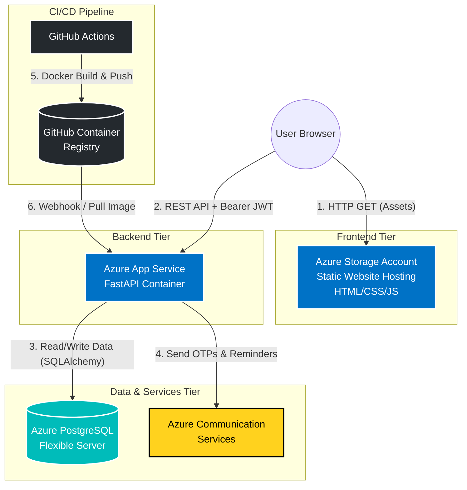
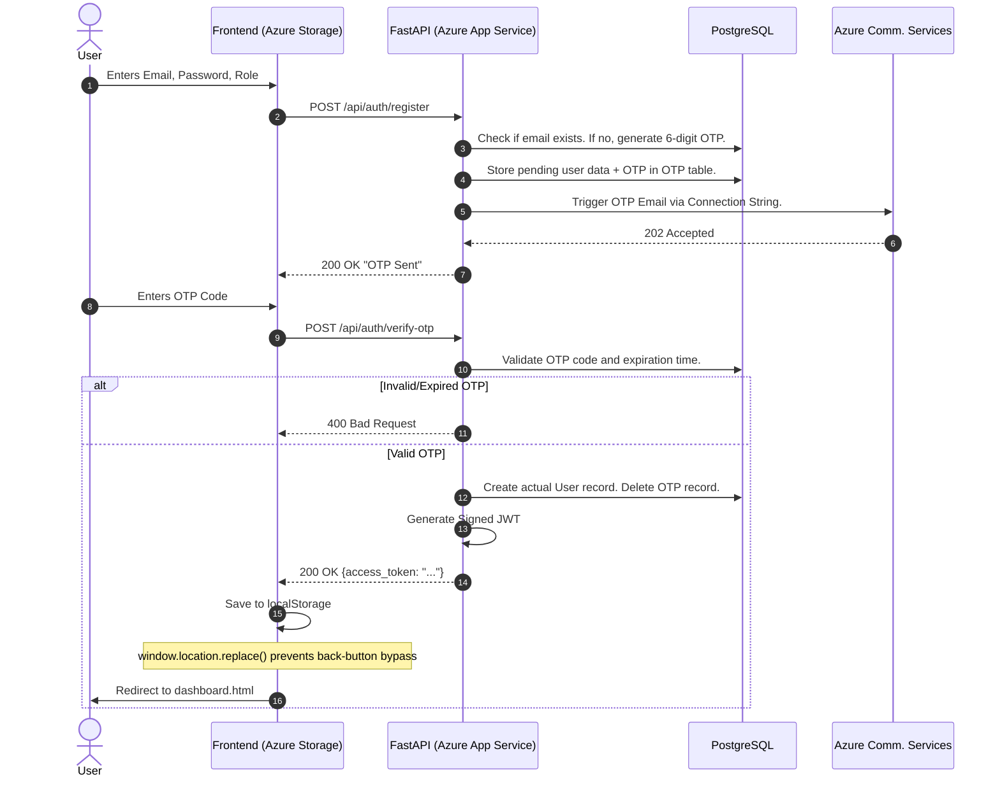
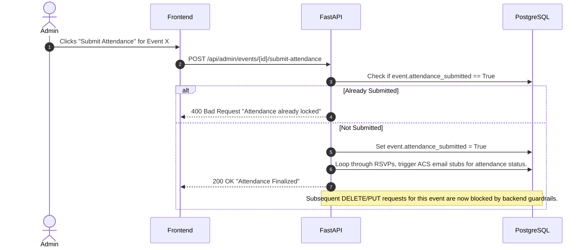
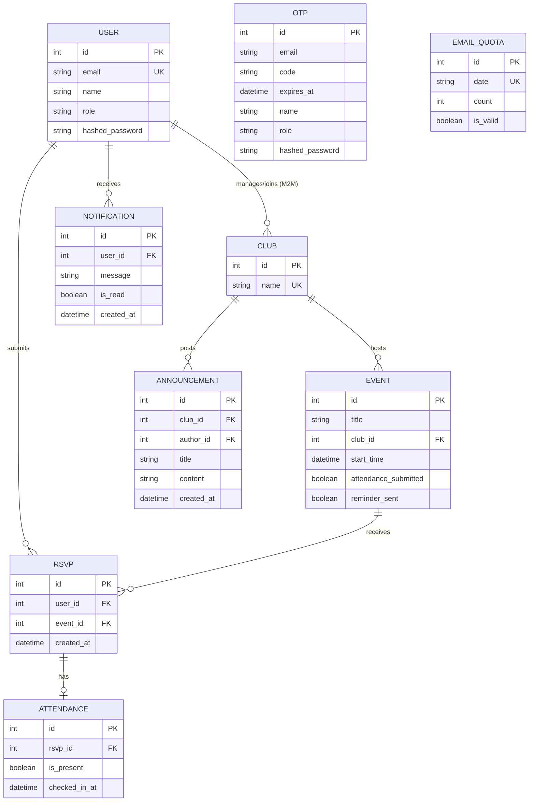
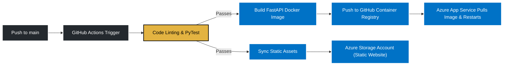

# Architecture Design Document: EventHub

**Author:** Dhruv Puri 
**Date:** 18 July 2026  
**Segment:** Segment 4 — Foundations of Cloud & DevOps  
**Problem Statement:** J2 — Internal Tool Backbone  

## 1. System Overview
EventHub is an internal event management tool built to streamline how university student clubs organize gatherings, manage RSVPs, and track attendance. It replaces chaotic WhatsApp/Google Form workflows with a centralized, role-based platform.

**Week 3 Mini-Extension (Automated Notifications):** The platform extends standard CRUD operations by integrating a production-grade transactional email pipeline using **Azure Communication Services (ACS)**. This powers secure OTP-based user registration, password resets, automated RSVP confirmations, 24-hour event reminders, and attendance finalization receipts. To prevent API abuse during demos, the system is protected by a custom `EmailQuota` database guardrail and a global frontend toggle.

**AI Extension (EventBot):** A lightweight, guardrailed `/api/bot/ask` endpoint provides students with instant, rule-based answers to common event queries, serving as the foundational seed for a future Retrieval-Augmented Generation (RAG) implementation.

---

## 2. Cloud Infrastructure Topology

The system uses a highly decoupled, cloud-native architecture. Frontend assets are served via edge caching, the API handles business logic and authentication, and external cloud services handle specialized workloads (email delivery).



---

## 3. Tech Stack Matrix

| Component | Technology | Rationale |
| --- | --- | --- |
| **Backend API** | FastAPI (Python 3.11+) | High-throughput asynchronous framework with native Pydantic validation and auto-generated OpenAPI documentation. |
| **Database** | Azure PostgreSQL | Enterprise-grade relational engine for enforcing strict constraints across Users, Clubs, Events, and RSVPs. |
| **Frontend** | HTML / CSS / Vanilla JS | Zero-dependency, lightweight static assets optimized for fast edge delivery via Azure Storage Account. |
| **Authentication** | JWT + Bcrypt + OTP | Secure, stateless token-based security paired with time-bound OTP verification to prevent database bloat from unverified accounts. |
| **Notification Engine** | Azure Communication Services (ACS) | Native Azure integration for transactional emails without the strict domain-verification friction of third-party providers like SendGrid. |
| **Cloud Hosting** | Azure PaaS Ecosystem | Platform-as-a-Service deployment that cleanly decouples frontend and backend infrastructure while maintaining unified billing and IAM. |

---

## 4. Core System Flows

### Flow A: Stateless Authentication & OTP Verification
This flow details how the decoupled frontend securely handles registration via OTP, stores the JWT, and routes the user without leaving traces in the browser history stack.



### Flow B: Event Lifecycle & Guardrails
This flow demonstrates how the system prevents data corruption once an event's attendance is finalized.



---

## 5. Database Schema & Entity Relationships

The PostgreSQL database enforces relational integrity across all entities. The following Entity-Relationship (ER) diagram maps the cardinality, including the new tables for OTP, Notifications, Announcements, and Email Quotas.



---

## 6. Security & Governance Posture

To ensure platform integrity and data privacy, EventHub implements security at multiple layers:

1. **Network Level (CORS):** The FastAPI backend explicitly defines allowed origins. Only requests originating from the verified Azure Storage Account domain will be processed, mitigating Cross-Site Request Forgery (CSRF).
2. **Data Layer (Cryptographic Hashing):** All passwords are one-way hashed using `Bcrypt` with a dynamic salt before reaching the database. Plain-text passwords never exist in memory post-validation.
3. **Session Layer (Stateless Auth):** JSON Web Tokens (JWT) are signed using a server-side secret (`HS256`). They carry a strict 60-minute expiration payload to ensure stale sessions are automatically invalidated.
4. **Business Logic Guardrails:** 
   - **Temporal Buffers:** Events cannot be created or edited to start in less than 3 hours.
   - **State Locking:** Once `attendance_submitted` is true, all `DELETE` and `PUT` requests for that event or its RSVPs are hard-blocked at the API level.
   - **Abuse Prevention:** The `EmailQuota` model hard-limits outbound ACS emails to 10 per day, with a global toggle to disable the pipeline instantly for demo environments.

---

## 7. CI/CD Deployment Strategy (DevOps Core)

As a Cloud & DevOps-focused project, manual deployments are replaced by automated GitHub Actions pipelines.



**Pipeline Stages:**
1. **Trigger:** Activated on direct merges to the `main` branch.
2. **Validation:** Runs `pytest` to ensure core CRUD, Auth, and Guardrail logic is unbroken.
3. **Delivery:** If tests pass, GitHub Actions builds the Docker image, pushes it to GHCR, and triggers the Azure App Service deployment webhook.

---

## 8. Directory Blueprint

```text
.
├── backend/
│   └── app/
│       ├── auth.py            # JWT token creation, Bcrypt hashing, role checkers
│       ├── database.py        # SQLAlchemy engine, session lifecycle
│       ├── email_extension.py # ACS integration, EmailQuota guardrails, notification logic
│       ├── main.py            # FastAPI entry point, CORS config, all API endpoints
│       ├── models.py          # SQLAlchemy ORM models (Users, Clubs, Events, OTP, etc.)
│       └── schemas.py         # Pydantic data validation schemas
├── frontend/              
│   ├── index.html             # Tabbed Login/Signup/OTP interface
│   ├── index.css              # Authentication styling & animations
│   ├── index.js               # Auth logic, OTP handling, theme persistence
│   ├── dashboard.html         # Role-based dashboard (Student/Admin/Coordinator)
│   ├── dashboard.css          # CSS Variables, Dynamic Theming, Responsive Layout
│   └── dashboard.js           # State management, authFetch wrapper, DOM manipulation
├── tests/
│   └── test_auth.py           # Pytest suite for backend guardrails
├── docs/
│   ├── ADR-001.md             # Decoupled Vanilla JS Frontend with JWT
│   ├── ADR-002.md             # Unified Azure PaaS Ecosystem
│   ├── AAD-003.md             # Azure ACS & Guardrails for Transactional Emails
│   └── design_doc.md          # This file
├── .env.example               # Template for environment variables
├── .gitignore                 # Protects .env, .venv, and local artifacts
├── requirements.txt           # Python dependencies
└── README.md                  # Project overview, quickstart, and architecture
```

---

## 9. Core API Endpoints Specification

**Authentication & Users**
* `POST /api/auth/register` - Initiates registration, generates OTP, stores pending data, triggers ACS email.
* `POST /api/auth/verify-otp` - Validates OTP, creates actual User record, returns JWT.
* `POST /api/auth/login` - Validates credentials and returns JWT.
* `POST /api/auth/forgot-password` & `POST /api/auth/reset-password` - Secure password recovery via OTP.
* `GET /api/users/me` - Validates JWT and returns current user data.

**Event Core Functions**
* `POST /api/admin/events` - Club Admins create events (enforces 3-hour temporal buffer).
* `GET /api/events/upcoming` - Students fetch events for clubs they have joined.
* `POST /api/events/{id}/rsvp` - Students register for an event (triggers ACS confirmation email).
* `POST /api/admin/events/{id}/submit-attendance` - Locks the event, prevents further mutations, and triggers bulk attendance status emails.

**Coordinator & System**
* `GET /api/coordinator/reports` - Aggregated analytics (attendance rates, top events, club metrics).
* `PUT /api/system/toggle-email` - Global switch to enable/disable the ACS email pipeline for demo safety.
* `POST /api/system/send-reminders` - Cron-triggerable endpoint to blast 24-hour event reminders.
* `POST /api/bot/ask` - Guardrailed, context-based endpoint for student event queries.

---

## 10. Next Milestones for Architecture Review

1. **CI/CD Finalization:** Complete the GitHub Actions workflow to seamlessly build, test, push to GHCR, and deploy to Azure App Service without manual intervention.
2. **EventBot Enhancement:** Expand the `/api/bot/ask` endpoint from simple keyword matching to a lightweight, guardrailed context-based API (or basic RAG) to handle complex student queries about club rulebooks.
3. **Schema Migrations:** Transition from `Base.metadata.create_all()` to `Alembic` for version-controlled, production-safe database schema migrations within the CI/CD pipeline.
