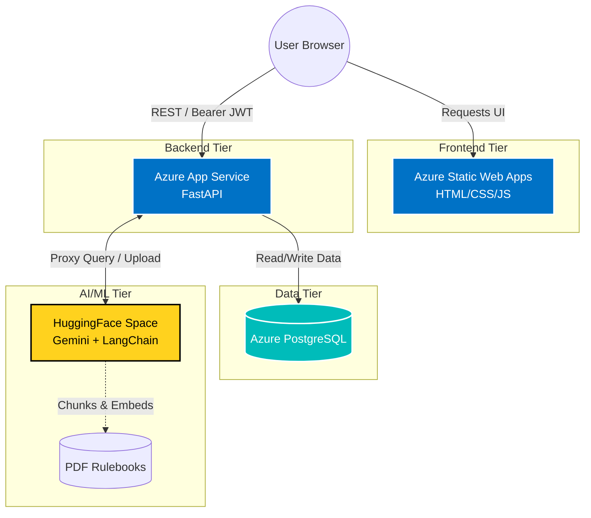
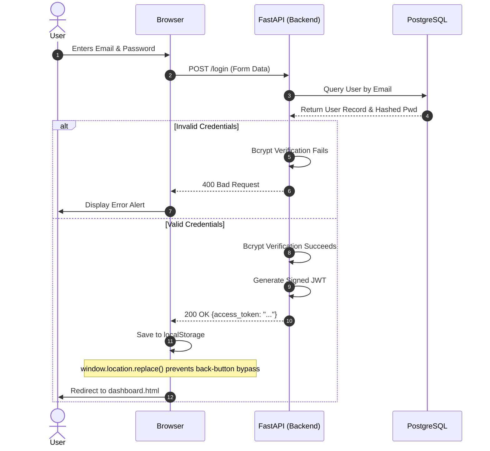
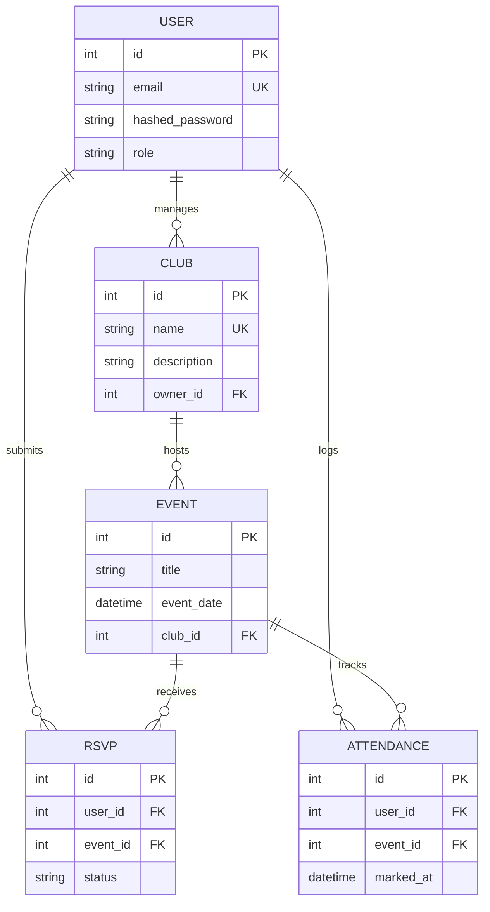
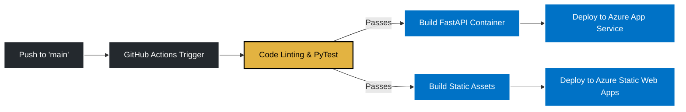

# Architecture Design Document: EventHub + RAG

**Author:** Dhruv  
**Date:** 4 July 2026  
**Segment:** Segment 4 — Foundations of Cloud & DevOps  
**Problem Statement:** J2 — Internal Tool Backbone  

## 1. System Overview
EventHub is an internal event management tool built to streamline how university student clubs organize gatherings, manage RSVPs, and track attendance. 
**AI Extension (RAG):** The platform extends standard CRUD operations by integrating a Retrieval-Augmented Generation (RAG) engine hosted on HuggingFace. Club Admins can upload event rulebooks, and the system acts as an AI assistant, answering student queries strictly based on the uploaded documents.

---

## 2. Cloud Infrastructure Topology

The system uses a highly decoupled, cloud-native architecture. Frontend assets are served via a CDN, the API handles business logic and authentication, and heavy ML workloads are offloaded to a dedicated microservice.



---

## 3. Tech Stack Matrix

| Component | Technology | Rationale |
| --- | --- | --- |
| **Backend API** | FastAPI (Python 3.11+) | Asynchronous performance, native Pydantic validation, and auto-generated OpenAPI documentation. |
| **Database** | PostgreSQL | Relational storage ideal for handling complex constraints between Users, Events, and RSVPs. |
| **Frontend** | HTML / CSS / Vanilla JS | Zero-dependency, lightweight static assets optimized for fast edge delivery via Azure Static Web Apps. |
| **Authentication** | JWT + Bcrypt | Secure, stateless token-based security paired with secure password hashing. |
| **AI/RAG Engine** | HuggingFace Spaces | Isolated environment to run document parsing and LLM inference without blocking main API event loops. |

---

## 4. Core System Flows

### Flow A: Stateless Authentication & Routing

This flow details how the decoupled frontend securely receives and stores the JWT, and routes the user without leaving traces in the browser history stack.



## 4. Database Schema & Entity Relationships

The PostgreSQL database enforces relational integrity across all entities. The following Entity-Relationship (ER) diagram maps the cardinality between Users, Clubs, Events, and RSVPs.



---

### Addition 2: Security & Governance Posture
## Security & Governance Posture

To ensure platform integrity and data privacy, EventHub implements security at multiple layers:

1. **Network Level (CORS):** The FastAPI backend explicitly defines allowed origins. Only requests originating from the verified Azure Static Web Apps domain will be processed, mitigating Cross-Site Request Forgery (CSRF).
2. **Data Layer (Cryptographic Hashing):** All passwords are one-way hashed using `Bcrypt` with a dynamic salt before reaching the database. Plain-text passwords never exist in memory post-validation.
3. **Session Layer (Stateless Auth):** JSON Web Tokens (JWT) are signed using a server-side secret (`HS256`). They carry an expiration payload to ensure stale sessions are automatically invalidated.
4. **AI Layer (Prompt Guardrails):** The HuggingFace proxy endpoint will implement basic input sanitization to prevent "Prompt Injection" attacks (e.g., users trying to instruct the LLM to ignore its system prompt and print sensitive data).


---

### Addition 3: CI/CD Deployment Strategy (DevOps Core)
## Continuous Integration / Continuous Deployment (CI/CD)

As a Cloud & DevOps-focused project, manual deployments will be replaced by automated GitHub Actions pipelines.



**Pipeline Stages:**

1. **Trigger:** Activated on Pull Requests or direct merges to the `main` branch.
2. **Validation:** Runs `pytest` to ensure core CRUD and Auth logic is unbroken.
3. **Delivery:** If tests pass, GitHub Actions injects the secure `.env` secrets from GitHub Secrets and pushes the compiled artifacts to Azure infrastructure.

```


**These three additions make your documentation look like a blueprint for a real startup.** Since your Week 1 deliverables are due today, do you want to finalize this documentation and push it, or do you want to brainstorm the actual HuggingFace RAG Python code you'll need for Week 2?

```

---

## 5. Directory Blueprint

```text
├── backend/
│   ├── main.py            # FastAPI entry point, CORS config, and proxy endpoints
│   ├── models.py          # SQLAlchemy ORM models (Users, Clubs, Events, RSVPs)
│   ├── schema.py          # Pydantic data validation schemas
│   ├── database.py        # Connection pooling and session lifecycle
│   ├── auth.py            # JWT token creation and Bcrypt hashing mechanics
│   └── requirements.txt
├── frontend/              
│   ├── index.html         # Tabbed Login/Signup interface
│   ├── dashboard.html     # Role-based dashboard (Student/Admin/Coordinator)
│   └── style.css          # CSS Variables, Animations, UI Styling
├── docs/
│   ├── adr/               # Architecture Decision Records
│   └── design_doc.md      # This file
├── .env                   # DB credentials and JWT secret (git-ignored)
└── docker-compose.yml     # (Planned) Container orchestration for local dev

```

---

## 6. Core API Endpoints Specification

**Authentication & Users**

* `POST /register` - Creates a new user with a securely hashed password.
* `POST /login` - Validates credentials (OAuth2 Form) and returns a JWT.
* `GET /users/me` - Validates JWT and returns current user data.

**Event Core Functions (To Be Built)**

* `POST /api/v1/events` - Executed by Club Admins to post upcoming events.
* `GET /api/v1/events` - Public endpoint allowing students to search events.
* `POST /api/v1/events/{id}/rsvp` - Enables students to register a seat (Triggers Email).

**RAG Integration (To Be Built)**

* `POST /api/v1/events/{id}/docs` - Admins upload PDF rulebooks.
* `POST /api/v1/events/{id}/ask` - Students ask questions about the event rules.

---

## 7. Next Milestones for Architecture Review

1. **Dockerization:** Wrap the PostgreSQL instance and FastAPI server in Docker containers orchestrated by `docker-compose.yml` for seamless local testing.
2. **HuggingFace API Integration:** Finalize the reverse-proxy logic in FastAPI to securely stream multipart file uploads directly to the HuggingFace endpoint without dropping the connection.


